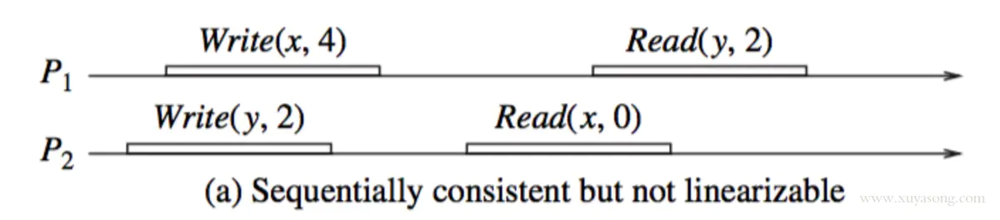
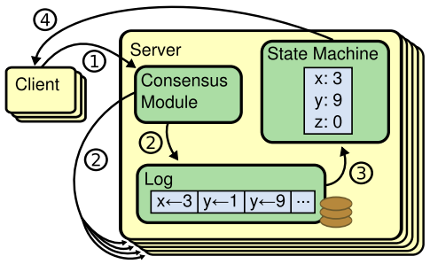
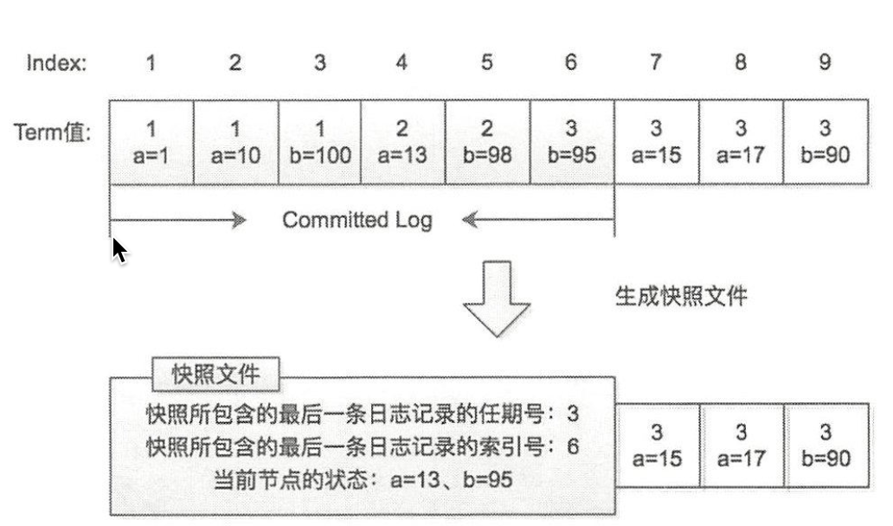

## 1 CAP
* Consistency 一致性，这里指的是强一致性，原子读写
* Availability 可用性
* Partition tolerance 分区容错性

以上只能最多满足两个

## 2 一致性
### 2.1 以数据为中心的一致性模型
#### 2.1.1 Strong Consistency 强一致性
强一致性也称原子一致性、可线性化(Linearizability)
1. 任何一次读都能读到某个数据的最近一次写的数据
2. 系统中所有进程看到的操作顺序都与全局时钟下的顺序一致

通常情况，单机遵守严格一致性，但是分布式系统很难为每个操作都分配一个准确的全局时间戳，因此严格一致性只是理论的一致性模型

然而，通常的编程方式使语句执行的确切时间并不重要，事件的读写顺序是非常重要的，可以使用信号量等同步方法进行同步操作，如单机多线程环境下实际上是一种顺序一致性模型

#### 2.1.2 Sequential Consistency 顺序一致性
顺序一致性也称可序列化
1. 顺序一致性放弃了全局时钟的的约束，它是指所有进程都有相同的顺序看到所有的修改
2. 读操作未必能及时得到此前其他进程对同一数据的写更新，但是每个进程读到的该数据不同值的顺序是一致的
3. 它只要求系统中所有的进程达成自己认为的一致性就可以了，不要求和全局顺序保持一致


* x 和 y 的初始值为 0
* Write(x,4)代表写入 x=4，Read(y,2)为读取 y =2

符合每个进程的顺序
```
Write(y,2), Read(x,0), Write(x,4), Read(y,2)
```
全局顺序
```
Write(y,2), Write(x,4), Read(x,0)(这里不符合全局一致性了，因为x已经被更新了), Read(y,2)
```

#### 2.1.3 Causal Consistency  因果一致性
todo

#### 2.1.4 Serializable Consistency 串行化一致性
todo

### 2.2 以用户为中心的一致性模型
#### 2.2.1 Eventual Consistency 最终一致性
最终用户在延迟了一段时间（不一致窗口）后看到了最新更新的数据的值

### 2.3 复制状态机

* 一致性模块接受客户端命令追加到自己的操作日志，然后与其他服务器的一致性模块进行通讯保证执行的命令和顺序相同。
* 假设： 如果状态机拥有相同的初始状态，接收到相同的命令，处理这些命令的顺序也相同，那么最终状态就会相同。

### 2.4 拜占庭将军
至少 N/2 + 1， 不代表满足这个数量就万无一失

## 3. Paxos
todo

## 4. Raft
动画演示：http://thesecretlivesofdata.com//raft/

### 2.1　Leader 选举

* leader
    * 处理客户端的请求，写请求：追加本地一条日志，封装成消息同步给follower，集群超过半数节点收到该请求，leader 认为已提交（committed），想客户端返回
    * 定期给 follower 发送心跳，防止其他节点选举计时器过期，触发新一轮选举
* follower，不处理客户端请求，重定向给 leader
* candidate，follower 长时间没有收到 leader 的心跳，转化为 candidate 重新选举

两个超时时间：
* 选举超时时间（election timeout）一般是 150 - 300 ms 的随机数，follower -> candidate 转换的时间
* 心跳超时时间（heartbeat timeout）， leader 到  follower 心跳的超时时间, 远小于选举超时时间

任期（term）
* 全局连续的、递增的整数
* 每进行一次选举，任期 +1
* 每个节点都会记录当前的任期值和投票结果，赢得选举的节点成为该任期的leader，直到任期结束
* 一个选举任期内，可能没有候选者能超过半数，任期选举会失败；之后会等待下一次选举触发
* candidate 会投票给任期值比自己大的节点
* 有两个或者多个 leader 时，任期大的leader获得leader，其他直接变为 follower

### 2.2　日志复制
当leader 收到了更新操作后，会发生日志复制，过程如下：
1. leader 收到更新操作，将更新操作记录到本地 log
2. 向所有 follower 发送 append entries 消息（记录了leader 最近收到的请求日志）
3. follower 收到后记录本地 log，并响应
4. leader 收到半数回应后，认为已提交，更新状态并向客户端响应，同时向其他 follower 通知已提交
5. follower 收到后更新状态

本地 log 的索引：
* commitIndex, 当前节点已知的最大的已提交的索引值
* lastApplied， 最后一条被应用到状态机的日志索引值

leader 额外维护 follower 索引记录已发送 diff
* nextIndex []，记录每一个follower下一条日志的索引值
* matchIndex []，已经复制给每个follower的最大日志索引值

follower 无条件复制 leader 的日志复制请求，因此 follower 再投票时，会有响应的策略：
* follower 节点会拒绝日志记录没有自己新的 candidate，确保了已提交的日志记录不会丢失
* 能够接收到半数以上投票的candidate 一定能保证拥有全部最新的提交
* 日志新旧判定：任期号大的日志新；任期号相同，索引值大的日志新

### 2.3 异常情况
raft 采用强领导人机制，因此要保证 leader 出现故障也不会出现数据丢失, 日志复制的任意环节都可能出现故障，因此要分 case 进行分析： （todo 网络上很多分析）
　
### 2.4　日志压缩与快照

* 通常每个follower 独立创建快照
* 如果落后 leader 太多且leader 落后的日志也被删除了，leader 就会发送快照给 follower， etcd 会将快照消息和普通消息分开，在不同的通道进行操作

### 2.5 Raft保证读请求Linearizability的方法
1. Leader把每次读请求作为一条日志记录，以日志复制的形式提交，并应用到状态机后，读取状态机中的数据返回。（一次RTT、一次磁盘写）

2. 使用Leader Lease，保证整个集群只有一个Leader，Leader接收到都请求后，记录下当前的commitIndex为readIndex，当applyIndex大于等于readIndex 后，则可以读取状态机中的数据返回。（0次RTT、0次磁盘写）

3. 不使用Leader Lease，而是当Leader通过以下两点来保证整个集群中只有其一个正常工作的Leader：（1）在每个Term开始时，由于新选出的Leader可能不知道上一个Term的commitIndex，所以需要先在当前新的Term提交一条空操作的日志；（2）Leader每次接到读请求后，向多数节点发送心跳确认自己的Leader身份。之后的读流程与Leader Lease的做法相同。（一次RTT、0次磁盘写）

4. 从Follower节点读：Follower先向Leader询问readIndex，Leader收到Follower的请求后依然要通过2或3中的方法确认自己Leader的身份，然后返回当前的commitIndex作为readIndex，Follower拿到readIndex后，等待本地的applyIndex大于等于readIndex后，即可读取状态机中的数据返回。（2次或1次RTT、0次磁盘写）


