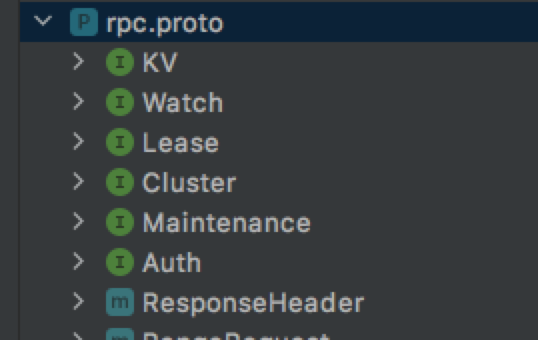

## rpc.proto

总共有6个服务

### KV 服务为例
主要有如下接口
```go
service KV {
  // Range gets the keys in the range from the key-value store.
  rpc Range(RangeRequest) returns (RangeResponse) {
      option (google.api.http) = {
        post: "/v3/kv/range"
        body: "*"
    };
  }

  // Put puts the given key into the key-value store.
  // A put request increments the revision of the key-value store
  // and generates one event in the event history.
  rpc Put(PutRequest) returns (PutResponse) {
      option (google.api.http) = {
        post: "/v3/kv/put"
        body: "*"
    };
  }

  // DeleteRange deletes the given range from the key-value store.
  // A delete request increments the revision of the key-value store
  // and generates a delete event in the event history for every deleted key.
  rpc DeleteRange(DeleteRangeRequest) returns (DeleteRangeResponse) {
      option (google.api.http) = {
        post: "/v3/kv/deleterange"
        body: "*"
    };
  }

  // Txn processes multiple requests in a single transaction.
  // A txn request increments the revision of the key-value store
  // and generates events with the same revision for every completed request.
  // It is not allowed to modify the same key several times within one txn.
  rpc Txn(TxnRequest) returns (TxnResponse) {
      option (google.api.http) = {
        post: "/v3/kv/txn"
        body: "*"
    };
  }

  // Compact compacts the event history in the etcd key-value store. The key-value
  // store should be periodically compacted or the event history will continue to grow
  // indefinitely.
  rpc Compact(CompactionRequest) returns (CompactionResponse) {
      option (google.api.http) = {
        post: "/v3/kv/compaction"
        body: "*"
    };
  }
}
```
pb 生成的代码有KVServer 接口，etcd-server 有对该接口的实现
```go
type kvServer struct {
    // 用于填充响消息的头信息
    hdr header
    // RaftKV 接口继承了 KVServer接口，实际上指向的就是 EtcdServer 实例
	kv  etcdserver.RaftKV
	// maxTxnOps is the max operations per txn.
	// e.g suppose maxTxnOps = 128.
	// Txn.Success can have at most 128 operations,
    // and Txn.Failure can have at most 128 operations.
    // 每个事务最大的操作数
	maxTxnOps uint
}
```
以 Range 为例
```go
func (s *kvServer) Range(ctx context.Context, r *pb.RangeRequest) (*pb.RangeResponse, error) {
	if err := checkRangeRequest(r); err != nil {
		return nil, err
	}
    // 调用 etcdserver.Range
	resp, err := s.kv.Range(ctx, r)
	if err != nil {
		return nil, togRPCError(err)
	}

	s.hdr.fill(resp.Header)
	return resp, nil
}
```
```go
func (s *EtcdServer) Range(ctx context.Context, r *pb.RangeRequest) (*pb.RangeResponse, error) {
	trace := traceutil.New("range",
		s.getLogger(),
		traceutil.Field{Key: "range_begin", Value: string(r.Key)},
		traceutil.Field{Key: "range_end", Value: string(r.RangeEnd)},
	)
	ctx = context.WithValue(ctx, traceutil.TraceKey, trace)

	var resp *pb.RangeResponse
	var err error
	defer func(start time.Time) {
		warnOfExpensiveReadOnlyRangeRequest(s.getLogger(), start, r, resp, err)
		if resp != nil {
			trace.AddField(
				traceutil.Field{Key: "response_count", Value: len(resp.Kvs)},
				traceutil.Field{Key: "response_revision", Value: resp.Header.Revision},
			)
		}
		trace.LogIfLong(traceThreshold)
	}(time.Now())
    // 重点在这儿，如果是线性读则会阻塞，知道 applyindex 追上了 commitindex
	if !r.Serializable {
		err = s.linearizableReadNotify(ctx)
		trace.Step("agreement among raft nodes before linearized reading")
		if err != nil {
			return nil, err
		}
    }
    // 检查访问权限
	chk := func(ai *auth.AuthInfo) error {
		return s.authStore.IsRangePermitted(ai, r.Key, r.RangeEnd)
	}

    // 从后端存储查询键值
	get := func() { resp, err = s.applyV3Base.Range(ctx, nil, r) }
	if serr := s.doSerialize(ctx, chk, get); serr != nil {
		err = serr
		return nil, err
	}
	return resp, err
}
```
以 put 为例
```go
func (s *EtcdServer) Put(ctx context.Context, r *pb.PutRequest) (*pb.PutResponse, error) {
	ctx = context.WithValue(ctx, traceutil.StartTimeKey, time.Now())
	resp, err := s.raftRequest(ctx, pb.InternalRaftRequest{Put: r})
	if err != nil {
		return nil, err
	}
	return resp.(*pb.PutResponse), nil
}
```
发现调用了 raftRequest, 最终调用了 processInternalRaftRequestOnce
```go
func (s *EtcdServer) processInternalRaftRequestOnce(ctx context.Context, r pb.InternalRaftRequest) (*applyResult, error) {
	ai := s.getAppliedIndex()
	ci := s.getCommittedIndex()
	if ci > ai+maxGapBetweenApplyAndCommitIndex {
		return nil, ErrTooManyRequests
	}

	r.Header = &pb.RequestHeader{
		ID: s.reqIDGen.Next(),
	}

	authInfo, err := s.AuthInfoFromCtx(ctx)
	if err != nil {
		return nil, err
	}
	if authInfo != nil {
		r.Header.Username = authInfo.Username
		r.Header.AuthRevision = authInfo.Revision
	}

	data, err := r.Marshal()
	if err != nil {
		return nil, err
	}

	if len(data) > int(s.Cfg.MaxRequestBytes) {
		return nil, ErrRequestTooLarge
	}

	id := r.ID
	if id == 0 {
		id = r.Header.ID
	}
	ch := s.w.Register(id)

	cctx, cancel := context.WithTimeout(ctx, s.Cfg.ReqTimeout())
	defer cancel()

	start := time.Now()
	err = s.r.Propose(cctx, data)
	if err != nil {
		proposalsFailed.Inc()
		s.w.Trigger(id, nil) // GC wait
		return nil, err
	}
	proposalsPending.Inc()
	defer proposalsPending.Dec()

	select {
	case x := <-ch:
		return x.(*applyResult), nil
	case <-cctx.Done():
		proposalsFailed.Inc()
		s.w.Trigger(id, nil) // GC wait
		return nil, s.parseProposeCtxErr(cctx.Err(), start)
	case <-s.done:
		return nil, ErrStopped
	}
}
```
这个方法的处理是先用request的id注册一个channel，调用raftNode的Propose()方法，将request对象序列化成byte数组，作为参数传入Propose()方法，最后等待刚刚注册的channel上的数据，node会在请求已经apply到状态机以后，也就是请求处理结束以后，往这个channel推送一个ApplyResult对象，触发等待它的请求处理协程继续往下走，返回请求结果。

## 启动服务
* 每个节点对外提供两组地址，一组用于集群中其他节点交互的url（peer url），另一组是与客户端交互的url（client url）
* 首先为每个url注册相应的 Listener

```go
type Etcd struct {
	Peers   []*peerListener
	Clients []net.Listener
	// a map of contexts for the servers that serves client requests.
	sctxs            map[string]*serveCtx
	metricsListeners []net.Listener

	Server *etcdserver.EtcdServer

	cfg   Config
	stopc chan struct{}
	errc  chan error

	closeOnce sync.Once
}
```
```go
func StartEtcd(inCfg *Config) (e *Etcd, err error) {
	if err = inCfg.Validate(); err != nil {
		return nil, err
	}
	serving := false
	e = &Etcd{cfg: *inCfg, stopc: make(chan struct{})}
	cfg := &e.cfg

    // peerListeners
	if e.Peers, err = configurePeerListeners(cfg); err != nil {
		return e, err
	}

   // client Listerners
	if e.sctxs, err = configureClientListeners(cfg); err != nil {
		return e, err
	}

	for _, sctx := range e.sctxs {
		e.Clients = append(e.Clients, sctx.l)
	}

	var (
		urlsmap types.URLsMap
		token   string
	)
    ... 
    // 创建 etcdserver
	srvcfg := etcdserver.ServerConfig{
		Name:                        cfg.Name,
		ClientURLs:                  cfg.ACUrls,
		PeerURLs:                    cfg.APUrls,
		DataDir:                     cfg.Dir,
		DedicatedWALDir:             cfg.WalDir,
		SnapshotCount:               cfg.SnapshotCount,
		SnapshotCatchUpEntries:      cfg.SnapshotCatchUpEntries,
		MaxSnapFiles:                cfg.MaxSnapFiles,
		MaxWALFiles:                 cfg.MaxWalFiles,
		InitialPeerURLsMap:          urlsmap,
		InitialClusterToken:         token,
		DiscoveryURL:                cfg.Durl,
		DiscoveryProxy:              cfg.Dproxy,
		NewCluster:                  cfg.IsNewCluster(),
		PeerTLSInfo:                 cfg.PeerTLSInfo,
		TickMs:                      cfg.TickMs,
		ElectionTicks:               cfg.ElectionTicks(),
		InitialElectionTickAdvance:  cfg.InitialElectionTickAdvance,
		AutoCompactionRetention:     autoCompactionRetention,
		AutoCompactionMode:          cfg.AutoCompactionMode,
		QuotaBackendBytes:           cfg.QuotaBackendBytes,
		BackendBatchLimit:           cfg.BackendBatchLimit,
		BackendFreelistType:         backendFreelistType,
		BackendBatchInterval:        cfg.BackendBatchInterval,
		MaxTxnOps:                   cfg.MaxTxnOps,
		MaxRequestBytes:             cfg.MaxRequestBytes,
		StrictReconfigCheck:         cfg.StrictReconfigCheck,
		ClientCertAuthEnabled:       cfg.ClientTLSInfo.ClientCertAuth,
		AuthToken:                   cfg.AuthToken,
		BcryptCost:                  cfg.BcryptCost,
		TokenTTL:                    cfg.AuthTokenTTL,
		CORS:                        cfg.CORS,
		HostWhitelist:               cfg.HostWhitelist,
		InitialCorruptCheck:         cfg.ExperimentalInitialCorruptCheck,
		CorruptCheckTime:            cfg.ExperimentalCorruptCheckTime,
		PreVote:                     cfg.PreVote,
		Logger:                      cfg.logger,
		LoggerConfig:                cfg.loggerConfig,
		LoggerCore:                  cfg.loggerCore,
		LoggerWriteSyncer:           cfg.loggerWriteSyncer,
		Debug:                       cfg.Debug,
		ForceNewCluster:             cfg.ForceNewCluster,
		EnableGRPCGateway:           cfg.EnableGRPCGateway,
		UnsafeNoFsync:               cfg.UnsafeNoFsync,
		EnableLeaseCheckpoint:       cfg.ExperimentalEnableLeaseCheckpoint,
		CompactionBatchLimit:        cfg.ExperimentalCompactionBatchLimit,
		WatchProgressNotifyInterval: cfg.ExperimentalWatchProgressNotifyInterval,
	}
	print(e.cfg.logger, *cfg, srvcfg, memberInitialized)
	if e.Server, err = etcdserver.NewServer(srvcfg); err != nil {
		return e, err
	}

	// buffer channel so goroutines on closed connections won't wait forever
	e.errc = make(chan error, len(e.Peers)+len(e.Clients)+2*len(e.sctxs))

	e.Server.Start()

	if err = e.servePeers(); err != nil {
		return e, err
	}
	if err = e.serveClients(); err != nil {
		return e, err
	}
	if err = e.serveMetrics(); err != nil {
		return e, err
	}

	serving = true
	return e, nil
}
```

## Client
```go
// Client provides and manages an etcd v3 client session.
type Client struct {
	Cluster
	KV
	Lease
	Watcher
	Auth
	Maintenance

	conn *grpc.ClientConn

	cfg           Config
	creds         grpccredentials.TransportCredentials
	resolverGroup *endpoint.ResolverGroup
	mu            *sync.RWMutex

	ctx    context.Context
	cancel context.CancelFunc

	// Username is a user name for authentication.
	Username string
	// Password is a password for authentication.
	Password        string
	authTokenBundle credentials.Bundle

	callOpts []grpc.CallOption

	lg *zap.Logger
}
```
## 创建客户端样例
```go
var (
	dialTimeout    = 5 * time.Second
	requestTimeout = 10 * time.Second
	endpoints      = []string{"localhost:2379", "localhost:22379", "localhost:32379"}
)

func ExampleKV_put() {
	cli, err := clientv3.New(clientv3.Config{
		Endpoints:   endpoints,
		DialTimeout: dialTimeout,
	})
	if err != nil {
		log.Fatal(err)
	}
	defer cli.Close()

	ctx, cancel := context.WithTimeout(context.Background(), requestTimeout)
	_, err = cli.Put(ctx, "sample_key", "sample_value")
	cancel()
	if err != nil {
		log.Fatal(err)
	}
}
```
## 初始化client
```go
func newClient(cfg *Config) (*Client, error) {  
    // 创建 client实例
	ctx, cancel := context.WithCancel(baseCtx)
	client := &Client{
		conn:     nil,
		cfg:      *cfg,
		creds:    creds,
		ctx:      ctx,
		cancel:   cancel,
		mu:       new(sync.RWMutex),
		callOpts: defaultCallOpts,
	}
    // 配置用户名密码
	if cfg.Username != "" && cfg.Password != "" {
		client.Username = cfg.Username
		client.Password = cfg.Password
	}

	// Prepare a 'endpoint://<unique-client-id>/' resolver for the client and create a endpoint target to pass
	// to dial so the client knows to use this resolver.
	client.resolverGroup, err = endpoint.NewResolverGroup(fmt.Sprintf("client-%s", uuid.New().String()))
	if err != nil {
		client.cancel()
		return nil, err
	}
	client.resolverGroup.SetEndpoints(cfg.Endpoints)

	if len(cfg.Endpoints) < 1 {
		return nil, fmt.Errorf("at least one Endpoint must is required in client config")
	}
	dialEndpoint := cfg.Endpoints[0]

	// Use a provided endpoint target so that for https:// without any tls config given, then
    // grpc will assume the certificate server name is the endpoint host.
    // 建立连接
	conn, err := client.dialWithBalancer(dialEndpoint, grpc.WithBalancerName(roundRobinBalancerName))
	if err != nil {
		client.cancel()
		client.resolverGroup.Close()
		return nil, err
	}
	// TODO: With the old grpc balancer interface, we waited until the dial timeout
	// for the balancer to be ready. Is there an equivalent wait we should do with the new grpc balancer interface?
	client.conn = conn
    // 初始化Client结构的每一类客户端
	client.Cluster = NewCluster(client)
	client.KV = NewKV(client)
	client.Lease = NewLease(client)
	client.Watcher = NewWatcher(client)
	client.Auth = NewAuth(client)
	client.Maintenance = NewMaintenance(client)

	if cfg.RejectOldCluster {
		if err := client.checkVersion(); err != nil {
			client.Close()
			return nil, err
		}
	}

    // 获取集群列表，并本地缓存
	go client.autoSync()
	return client, nil
}
```
### KV 实例
上边会为 Client 创建 KV
```go
func NewKV(c *Client) KV {
	api := &kv{remote: RetryKVClient(c)}
	if c != nil {
		api.callOpts = c.callOpts
	}
	return api
}

type kv struct {
	remote   pb.KVClient
	callOpts []grpc.CallOption
}
```
然后通过rpc 发送请求