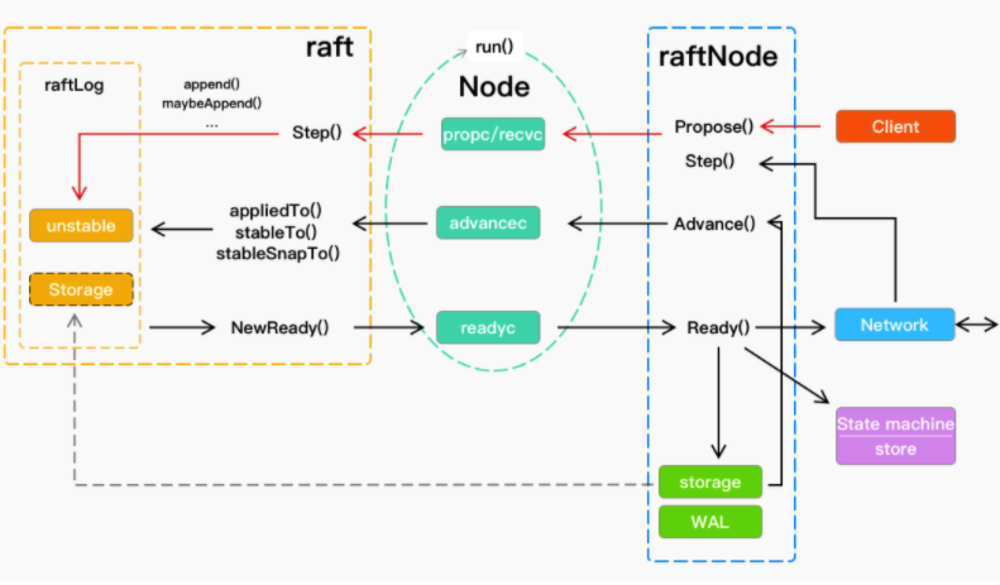
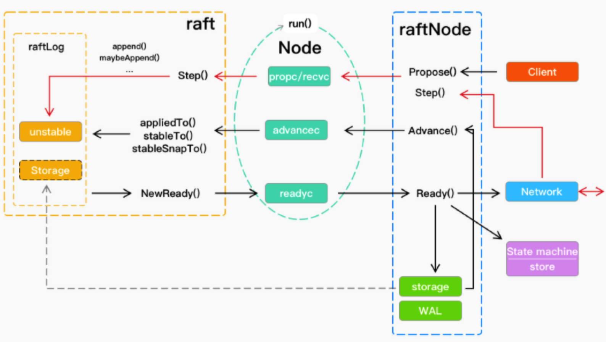

# 0 说明
etcd-raft 有两大结构体， raft 和 node

## node
node结构体实现了Node接口，负责跟应用层对接

## raft
raft结构体是raft算法的主要实现。

* node把输入推给raft，raft根据输入和当前的状态数据生成输出，输出临时保存在raft内，node会检查raft是否有输出，如果有输出数据，就把输出生成Ready结构体，并传递给应用层。

* raft应用层有一个storage，存放的是当前的状态数据，包含了保存在内存中的log entry，但这个storage并不是raft的，是应用层的，raft只从中读取数据，log entry 的写入由应用层负责。

# 1 总体架构

# 2 重要概念
* WAL是Write Ahead Logs的缩写，存储的是log entry记录，即所有写请求的记录。

* storage也是存的log entry，只不过是保存在内存中的。

* kv db是保存了所有数据的最新值，而log entry是修改数据值的操作记录。

* log entry在集群节点之间达成共识之后，log entry会写入WAL文件，也会写入storage，然后会被应用到kv store中，改变kv db中的数据。

* Snapshot是kv db是某个log entry被应用后生成的快照，可以根据快照快速回复kv db，而无需从所有的历史log entry依次应用，恢复kv db。

# 3. 数据流向
## 3.1 客户端请求

1. 客户端将请求发送给应用层raftNode
2. raftNode使用Propose方法，请求写入到propc通道
3. raft.Step接收到通道数据，会通过append等函数加入到raftLog
4. raftLog用来暂时存储和查询日志，请求会先加入到unstable

## 3.2 raft 发送消息

1. raft发现有数据发送给其他节点，数据可以是leader要发送给follower的日志、snapshot，或者其他类型的消息，比如follower给leader的响应消息
2. 利用NewReady创建结构体Ready，并写入到readyc通道
3. raftNode从通道读到Ready，取出其中的消息，交给Network发送给其他节点

## 3.3 raft 接收消息

1. 从Network收到消息，可以是leader给follower的消息，也可以是follower发给leader的响应消息，Network的handler函数将数据回传给raftNode
2. raftNode调用Step函数，将数据发给raft，数据被写入recvc通道
3. raft的Step从recvc收到消息，并修改raftLog中的日志

## 3.4 应用日志
raft会将达成一致的log通知给raftNode，让它应用到上层的数据库，数据流已经在下图用红色箭头标出，流程如下：

1. raft发现有日志需要交给raftNode，调用NewReady创建Ready，从raftLog读取日志，并存到Ready结构体
2. Ready结构体写入到readyc通道
3. raftNode读到Ready结构体，发现Ready结构体中包含日志
4. raftNode会把日志写入到storage和WAL，把需要应用的日志，提交给状态机或数据库，去修改数据
5. raftNode处理完Ready后，调用Advance函数，通过advancec发送一个信号给raft，告知raft传出来的Ready已经处理完毕
