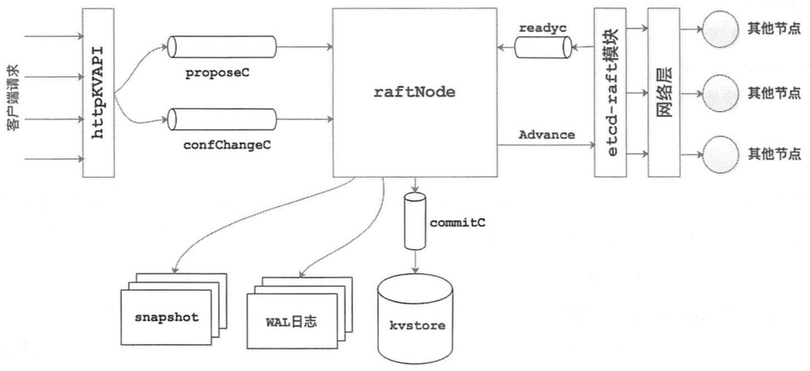
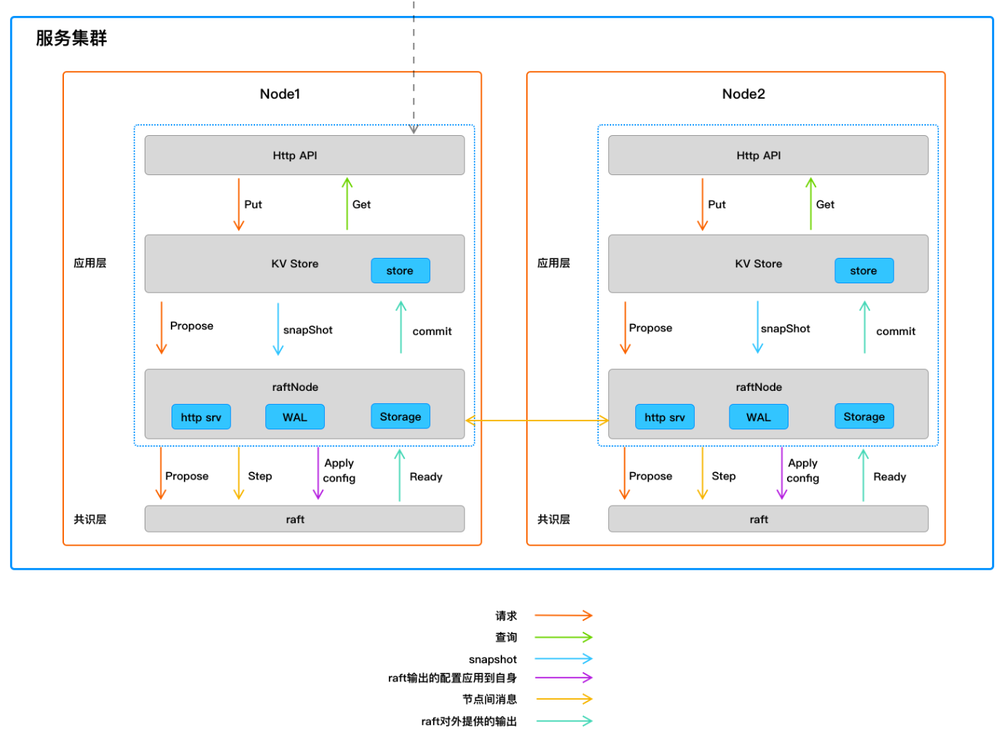

# 0. 说明
etcd-raft 的特点在于其设计屏蔽了网络、存储等其他模块，只提供接口交由上层应用者来实现，这样的设计思路使其具有很高的可定制性和可测试性。这也决定了想要使用 etcd，用户需要自己补全核心协议之外的部分。raftexample 是 etcd 官方提供的一个 kv 数据库示例程序，简单展示了 etcd-raft 的使用方式。

# 1. 总体架构

raft example 主要有 3 个部分组成：
* kvstore：持久化模块
* raftnode：核心 raft 组件，对 etcd-raft 的一层封装
* httpKVAPI：http对外服务

服务之间主要通过 3 个通道来进行交互：

* proposeC：用于处理客户端发来的数据更新请求
* confChangeC：处理配置变更信息的请求
* commitC：用于将 raft 产生的 entries 提交到持久化模块中
* readyC: 接受并处理底层 raft 返回的数据，这些数据被封装在 Ready 结构体

# 3. 详细架构

* etcd raft 实现了raft论文的核心，IO（磁盘存储、网络通信）等并没有实现，这些交给了应用层

## httpKVAPI
* 把客户端的写入请求PUT和查询请求GET都交给kv store
* 对于修改raft集群配置请求，它会生成ConfChange交给raftNode

## kvstore
kv 服务，持有一个 kv db（内存），用来存储用户数据。

* 对于查询请求，它直接从db中读取数据。
* 对于写入请求，需要修改用户数据，这就需要集群节点使用raft对请求达成共识，它把请求传递给raftNode。

## raftNode
raftNode用来跟 etcd raft交互：

* 将客户端发来的请求传递给 etcd-raft 进行处理
* 从 etcd-raft 的 node.readyc 通道中解析 Ready 实例，并进行处理
* 管理 wal 日志文件
* 管理快照数据
* 管理逻辑时钟
* 将 etcd-raft 返回的待发送消息通过网络组件发送到其他节点中
* 把客户端的写请求，修改raft配置的请求交给etcd raft，对于写请求，它会把请求数据编码后发送给etcd raft，etcd raft会把写请求封装成raft的Propose消息MsgProp，编码后的数据成为log Entry。因为raft并不关心具体的请求内容，它只需要保证每个集群节点在相同的log index拥有相同的log Entry，即请求即可。

# 参考
* https://lessisbetter.site/2019/08/19/etcd-raft-sources-arch/