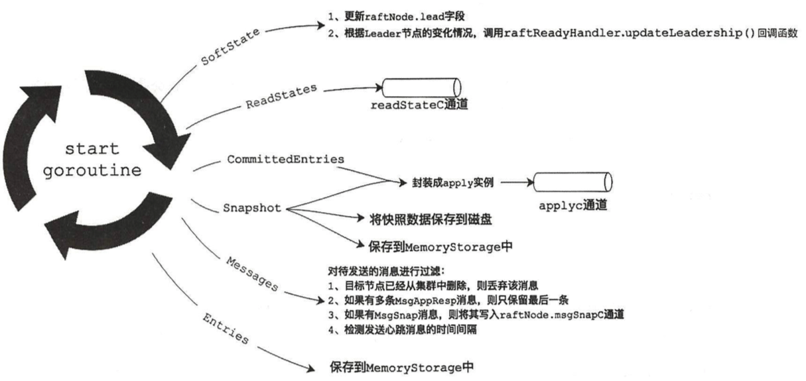

# 1. raftNode  底层raft和上层模块的桥梁
```go
type raftNode struct {
	lg *zap.Logger

    tickMu *sync.Mutex
    // 内嵌了 raftNodeConfig, 后面说明
	raftNodeConfig

    // a chan to send/receive snapshot
    // raftNode 收到 MsgSnap 消息后，会把 Message 发送到该通道，等待上层模块发送
	msgSnapC chan raftpb.Message

    // a chan to send out apply
    // raftNode 会把待应用的 Entry 和 快照数据封装成 apply实例，等待上层模块处理，  apply 后边会说明
	applyc chan apply

    // a chan to send out readState
    // 只读请求相关的通道，也是发给上层模块
	readStateC chan raft.ReadState

    // utility
    // 逻辑时钟定时器
	ticker *time.Ticker
    // contention detectors for raft heartbeat message
    // 检测同一节点的心跳消息是否超时
	td *contention.TimeoutDetector

	stopped chan struct{}
	done    chan struct{}
}

type raftNodeConfig struct {
	lg *zap.Logger

    // to check if msg receiver is removed from cluster
    // 检测指定节点是否移除集群
	isIDRemoved func(id uint64) bool
    raft.Node  // 内嵌了 raft.Node
    // 之前已经讲过了，和 raftLog.storage 指向同一实例，保存待持久化的 Entry 记录和快照数据
    raftStorage *raft.MemoryStorage
    // etcdserver 的 storage，不是raft里边storage 要注意，后面说明
    storage     Storage
    // 逻辑时钟刻度，后面会说明
	heartbeat   time.Duration // for logging
    // 前文描述的用于通过网络发送消息到集群其他节点的
	transport rafthttp.Transporter
}

type Storage interface {
    // 持久化 entry 和hardstate，可能会阻塞，是通过wal模块实现的
	Save(st raftpb.HardState, ents []raftpb.Entry) error
    // SaveSnap function saves snapshot to the underlying stable storage.
    // 持久化快照数据，可能阻塞，有前文的 Snapshotter 将快照保存到快照文件
	SaveSnap(snap raftpb.Snapshot) error
	// Close closes the Storage and performs finalization.
	Close() error
	// Release releases the locked wal files older than the provided snapshot.
	Release(snap raftpb.Snapshot) error
	// Sync WAL
	Sync() error
}
```

## 初始化 raftNode
```go
func newRaftNode(cfg raftNodeConfig) *raftNode {
	r := &raftNode{
		lg:             cfg.lg,
		tickMu:         new(sync.Mutex),
		raftNodeConfig: cfg,
		// set up contention detectors for raft heartbeat message.
		// expect to send a heartbeat within 2 heartbeat intervals.
		td:         contention.NewTimeoutDetector(2 * cfg.heartbeat),
        readStateC: make(chan raft.ReadState, 1),
        // 缓冲区大小是 axInFlightMsgSnap = 16
                     // max number of in-flight snapshot messages etcdserver allows to have
	                 // This number is more than enough for most clusters with 5 machines.
		msgSnapC:   make(chan raftpb.Message, maxInFlightMsgSnap),
		applyc:     make(chan apply),
		stopped:    make(chan struct{}),
		done:       make(chan struct{}),
    }
    // 根据 raftNodeConfig 的 heartbeat 创建逻辑时钟
	if r.heartbeat == 0 {
		r.ticker = &time.Ticker{}
	} else {
        // 刻度时 heartbeat
		r.ticker = time.NewTicker(r.heartbeat)
	}
	return r
}
```

## raftNode.start() 启动相关服务
创建了一个后台协程，用来与底层 raft模块进行交互
```go
func (r *raftNode) start(rh *raftReadyHandler) {
	internalTimeout := time.Second

	go func() {
        defer r.onStop()
        // 刚启动不是leader， 表示为 follower
		islead := false

		for {
			select {
            // 逻辑时钟触发
            case <-r.ticker.C:
                // 调用 raft.Node.Tick()
                r.tick()
            // 处理底层 raft 传过来的 Ready 对象，并进行处理, 具体实现后边说明，这里先跳过
            case rd := <-r.Ready():
                ...
                // 处理完调用 raft.node.Advance() 通知底层 raft 已经处理完该 Ready 实例
				r.Advance()
			case <-r.stopped:
				return
			}
		}
	}()
}
```
下面说明 具体是如果处理 Ready 对象的，代码片段如下:
!
```go
            case rd := <-r.Ready():
				if rd.SoftState != nil {
                    // 检查 leader 是否发生变化，更新 raftNode.lead 字段
					newLeader := rd.SoftState.Lead != raft.None && rh.getLead() != rd.SoftState.Lead
					if newLeader {
						leaderChanges.Inc()
					}

					if rd.SoftState.Lead == raft.None {
						hasLeader.Set(0)
					} else {
						hasLeader.Set(1)
					}
                    // raftReadyHandler 的 updateLead
                    // rh *raftReadyHandler 是 etcdserver 保存节点状态的结构（比如是否leader，entry提交位置等）
                    // raftNode 可以通过 raftReadyHandler 的函数修改 etcdserver 相关的字段
					rh.updateLead(rd.SoftState.Lead)
					islead = rd.RaftState == raft.StateLeader
					if islead {
						isLeader.Set(1)
					} else {
						isLeader.Set(0)
                    }
                    // 更新leadership 的具体操作，后边说明
                    rh.updateLeadership(newLeader)
                    // 重置探测器中的全部记录
					r.td.Reset()
				}
                
				if len(rd.ReadStates) != 0 {
					select {
                        // 将 ReadStates的最后一项写入 readStateC 通道
					case r.readStateC <- rd.ReadStates[len(rd.ReadStates)-1]:
                    case <-time.After(internalTimeout):
                        // 如果上层应用一直没读通道数据，等待超时后会放弃本次写入，打印报警日志
                        ...
					case <-r.stopped:
						return
					}
				}
   
                // 创建 notifyc 通道
                notifyc := make(chan struct{}, 1)
                // 创建 apply 实例
				ap := apply{
					entries:  rd.CommittedEntries,  // 已经提交待应用的 entry
					snapshot: rd.Snapshot,          // 待持久化的快照数据
					notifyc:  notifyc,              // 
				}

                // 更新 etcd server记录的已经提交的位置
				updateCommittedIndex(&ap, rh)

				select {
                    // 向 ap 数据写入 通道，待上层处理
				case r.applyc <- ap:
				case <-r.stopped:
					return
				}
                // 如果时 leader，对待发送的消息进行过滤，然后调用 transport 进行发送
				if islead {
					r.transport.Send(r.processMessages(rd.Messages))
				}

				if !raft.IsEmptySnap(rd.Snapshot) {
                    // 通过 etcdserver 的 storage 将 ready 中的快照数据保存到磁盘, 个人理解是发送的快照数据
					if err := r.storage.SaveSnap(rd.Snapshot); err != nil {
					}
				}

                // 通过 etcdserver 的 storage 持久化 entry 和 hardstate， 具体使用是wal
				if err := r.storage.Save(rd.HardState, rd.Entries); err != nil {
					}
				}
				if !raft.IsEmptyHardState(rd.HardState) {
					proposalsCommitted.Set(float64(rd.HardState.Commit))
				}
				// gofail: var raftAfterSave struct{}

				if !raft.IsEmptySnap(rd.Snapshot) {
                    // 强行同步 wal 等数据到磁盘
					if err := r.storage.Sync(); err != nil {
					}

                    // etcdserver now claim the snapshot has been persisted onto the disk
                    // 通知 上层应用协程，快照数据已经生成
					notifyc <- struct{}{}

                    // 保存快照信息到 MemoryStroage
                    r.raftStorage.ApplySnapshot(rd.Snapshot)


					if err := r.storage.Release(rd.Snapshot); err != nil {
					}
				}
                // 保存待持久化 entry 信息到 MemoryStroage
				r.raftStorage.Append(rd.Entries)

				if !islead {
                    // 不是 leader 的过滤 msg 消息
					msgs := r.processMessages(rd.Messages)

                    // 检测是否生成快照
					notifyc <- struct{}{}

                    // 发送消息
					r.transport.Send(msgs)
				} else {
					// leader already processed 'MsgSnap' and signaled
					notifyc <- struct{}{}
				}

				r.Advance()
```

## etcdserver.storage
```go
type Storage interface {
	// Save function saves ents and state to the underlying stable storage.
	// Save MUST block until st and ents are on stable storage.
	Save(st raftpb.HardState, ents []raftpb.Entry) error
	// SaveSnap function saves snapshot to the underlying stable storage.
	SaveSnap(snap raftpb.Snapshot) error
	// Close closes the Storage and performs finalization.
	Close() error
	// Release releases the locked wal files older than the provided snapshot.
	Release(snap raftpb.Snapshot) error
	// Sync WAL
	Sync() error
}

// 内嵌了前文的 wal 和 snapshotter
type storage struct {
	*wal.WAL
	*snap.Snapshotter
}
```
重写了 savesnap()
```go
func (st *storage) SaveSnap(snap raftpb.Snapshot) error {
    // 创建snapshot 实例
	walsnap := walpb.Snapshot{
		Index: snap.Metadata.Index,
		Term:  snap.Metadata.Term,
    }
    // 将快照写入磁盘
	err := st.Snapshotter.SaveSnap(snap)
	if err != nil {
		return err
	}
	// gofail: var raftBeforeWALSaveSnaphot struct{}

    // 将 walpbsnapshot 写入 wal
	return st.WAL.SaveSnapshot(walsnap)
}
```

# 2. raftCluster 记录集群节点的状态
```go
// RaftCluster is a list of Members that belong to the same raft cluster
type RaftCluster struct {
	lg *zap.Logger

	localID types.ID
	cid     types.ID
	token   string

    // v2 版本的存储
	v2store v2store.Store
	// v3 版本的存储
	be      backend.Backend

	sync.Mutex // guards the fields below
	version    *semver.Version
	// 每个节点都会有一个id 和对应的一个 Member 实例
	members    map[types.ID]*Member
	// removed contains the ids of removed members in the cluster.
	// removed id cannot be reused.
	removed map[types.ID]bool
}
```
已 AddMember 为例
```go
func (c *RaftCluster) AddMember(m *Member) {
	c.Lock()
	defer c.Unlock()
	// 根据后端存储的版本来持久化 Member 信息
	if c.v2store != nil {
		mustSaveMemberToStore(c.v2store, m)
	}
	if c.be != nil {
		mustSaveMemberToBackend(c.be, m)
	}

    // 补全 members 成员信息
	c.members[m.ID] = m

    // 打印相关信息
	if c.lg != nil {
		c.lg.Info(
			"added member",
			zap.String("cluster-id", c.cid.String()),
			zap.String("local-member-id", c.localID.String()),
			zap.String("added-peer-id", m.ID.String()),
			zap.Strings("added-peer-peer-urls", m.PeerURLs),
		)
	} else {
		plog.Infof("added member %s %v to cluster %s", m.ID, m.PeerURLs, c.cid)
	}
}
```

# 3. EtcdServer
```go
// EtcdServer is the production implementation of the Server interface
// 核心字段
type EtcdServer struct {
	// inflightSnapshots holds count the number of snapshots currently inflight.
	// 发送出去但是未响应的快照数据
	inflightSnapshots int64  // must use atomic operations to access; keep 64-bit aligned.
	// 节点应用的最大索引
	appliedIndex      uint64 // must use atomic operations to access; keep 64-bit aligned.
	// 节点提交的最大索引
	committedIndex    uint64 // must use atomic operations to access; keep 64-bit aligned.
	term              uint64 // must use atomic operations to access; keep 64-bit aligned.
	lead              uint64 // must use atomic operations to access; keep 64-bit aligned.

	// consistIndex used to hold the offset of current executing entry
	// It is initialized to 0 before executing any entry.
	consistIndex consistentIndex // must use atomic operations to access; keep 64-bit aligned.
	// etcdserver.raftNode
	r            raftNode        // uses 64-bit atomics; keep 64-bit aligned.

    // 节点自身的信息推送给其他节点后，会关闭通道，相当于是对外服务的一个信号
	readych chan struct{}
	Cfg     ServerConfig

	lgMu *sync.RWMutex
	lg   *zap.Logger

    // 负责协调多个协程之间的执行
	w wait.Wait

	readMu sync.RWMutex
	// read routine notifies etcd server that it waits for reading by sending an empty struct to
	// readwaitC
	// 用来协调线性读相关的协程
	readwaitc chan struct{}
	// readNotifier is used to notify the read routine that it can process the request
	// when there is no error
	readNotifier *notifier

	// stop signals the run goroutine should shutdown.
	stop chan struct{}
	// stopping is closed by run goroutine on shutdown.
	stopping chan struct{}
	// done is closed when all goroutines from start() complete.
	done chan struct{}
	// leaderChanged is used to notify the linearizable read loop to drop the old read requests.
	leaderChanged   chan struct{}
	leaderChangedMu sync.RWMutex

	errorc     chan error
	id         types.ID
	attributes membership.Attributes

    // 记录集群全部节点信息
	cluster *membership.RaftCluster

    // v2 版本存储
	v2store     v2store.Store
	// 用来读写快照文件
	snapshotter *snap.Snapshotter

    // 应用v2版本的 entry
	applyV2 ApplierV2

	// applyV3 is the applier with auth and quotas
    // 应用v3版本的 entry
	applyV3 applierV3
	// applyV3Base is the core applier without auth or quotas
	applyV3Base applierV3
	applyWait   wait.WaitTime

	kv         mvcc.ConsistentWatchableKV
	lessor     lease.Lessor
	bemu       sync.Mutex
	be         backend.Backend
	authStore  auth.AuthStore
	alarmStore *v3alarm.AlarmStore

	stats  *stats.ServerStats
	lstats *stats.LeaderStats

	SyncTicker *time.Ticker
	// compactor is used to auto-compact the KV.
	compactor v3compactor.Compactor

	// peerRt used to send requests (version, lease) to peers.
	peerRt   http.RoundTripper
	reqIDGen *idutil.Generator

	// forceVersionC is used to force the version monitor loop
	// to detect the cluster version immediately.
	forceVersionC chan struct{}

	// wgMu blocks concurrent waitgroup mutation while server stopping
	wgMu sync.RWMutex
	// wg is used to wait for the go routines that depends on the server state
	// to exit when stopping the server.
	wg sync.WaitGroup

	// ctx is used for etcd-initiated requests that may need to be canceled
	// on etcd server shutdown.
	ctx    context.Context
	cancel context.CancelFunc

	leadTimeMu      sync.RWMutex
	leadElectedTime time.Time

	*AccessController
}
```

## 初始化 server
```go
// NewServer creates a new EtcdServer from the supplied configuration. The
// configuration is considered static for the lifetime of the EtcdServer.
func NewServer(cfg ServerConfig) (srv *EtcdServer, err error) {
	st := v2store.New(StoreClusterPrefix, StoreKeysPrefix)

	var (
		w  *wal.WAL
		n  raft.Node
		s  *raft.MemoryStorage
		id types.ID
		cl *membership.RaftCluster
	)

	if cfg.MaxRequestBytes > recommendedMaxRequestBytes {
		if cfg.Logger != nil {
			cfg.Logger.Warn(
				"exceeded recommended request limit",
				zap.Uint("max-request-bytes", cfg.MaxRequestBytes),
				zap.String("max-request-size", humanize.Bytes(uint64(cfg.MaxRequestBytes))),
				zap.Int("recommended-request-bytes", recommendedMaxRequestBytes),
				zap.String("recommended-request-size", humanize.Bytes(uint64(recommendedMaxRequestBytes))),
			)
		} else {
			plog.Warningf("MaxRequestBytes %v exceeds maximum recommended size %v", cfg.MaxRequestBytes, recommendedMaxRequestBytes)
		}
	}

	if terr := fileutil.TouchDirAll(cfg.DataDir); terr != nil {
		return nil, fmt.Errorf("cannot access data directory: %v", terr)
	}

	haveWAL := wal.Exist(cfg.WALDir())

	if err = fileutil.TouchDirAll(cfg.SnapDir()); err != nil {
		if cfg.Logger != nil {
			cfg.Logger.Fatal(
				"failed to create snapshot directory",
				zap.String("path", cfg.SnapDir()),
				zap.Error(err),
			)
		} else {
			plog.Fatalf("create snapshot directory error: %v", err)
		}
	}
	ss := snap.New(cfg.Logger, cfg.SnapDir())

	bepath := cfg.backendPath()
	beExist := fileutil.Exist(bepath)
	be := openBackend(cfg)

	defer func() {
		if err != nil {
			be.Close()
		}
	}()

	prt, err := rafthttp.NewRoundTripper(cfg.PeerTLSInfo, cfg.peerDialTimeout())
	if err != nil {
		return nil, err
	}
	var (
		remotes  []*membership.Member
		snapshot *raftpb.Snapshot
	)

	switch {
	case !haveWAL && !cfg.NewCluster:
		if err = cfg.VerifyJoinExisting(); err != nil {
			return nil, err
		}
		cl, err = membership.NewClusterFromURLsMap(cfg.Logger, cfg.InitialClusterToken, cfg.InitialPeerURLsMap)
		if err != nil {
			return nil, err
		}
		existingCluster, gerr := GetClusterFromRemotePeers(cfg.Logger, getRemotePeerURLs(cl, cfg.Name), prt)
		if gerr != nil {
			return nil, fmt.Errorf("cannot fetch cluster info from peer urls: %v", gerr)
		}
		if err = membership.ValidateClusterAndAssignIDs(cfg.Logger, cl, existingCluster); err != nil {
			return nil, fmt.Errorf("error validating peerURLs %s: %v", existingCluster, err)
		}
		if !isCompatibleWithCluster(cfg.Logger, cl, cl.MemberByName(cfg.Name).ID, prt) {
			return nil, fmt.Errorf("incompatible with current running cluster")
		}

		remotes = existingCluster.Members()
		cl.SetID(types.ID(0), existingCluster.ID())
		cl.SetStore(st)
		cl.SetBackend(be)
		id, n, s, w = startNode(cfg, cl, nil)
		cl.SetID(id, existingCluster.ID())

	case !haveWAL && cfg.NewCluster:
		if err = cfg.VerifyBootstrap(); err != nil {
			return nil, err
		}
		cl, err = membership.NewClusterFromURLsMap(cfg.Logger, cfg.InitialClusterToken, cfg.InitialPeerURLsMap)
		if err != nil {
			return nil, err
		}
		m := cl.MemberByName(cfg.Name)
		if isMemberBootstrapped(cfg.Logger, cl, cfg.Name, prt, cfg.bootstrapTimeout()) {
			return nil, fmt.Errorf("member %s has already been bootstrapped", m.ID)
		}
		if cfg.ShouldDiscover() {
			var str string
			str, err = v2discovery.JoinCluster(cfg.Logger, cfg.DiscoveryURL, cfg.DiscoveryProxy, m.ID, cfg.InitialPeerURLsMap.String())
			if err != nil {
				return nil, &DiscoveryError{Op: "join", Err: err}
			}
			var urlsmap types.URLsMap
			urlsmap, err = types.NewURLsMap(str)
			if err != nil {
				return nil, err
			}
			if checkDuplicateURL(urlsmap) {
				return nil, fmt.Errorf("discovery cluster %s has duplicate url", urlsmap)
			}
			if cl, err = membership.NewClusterFromURLsMap(cfg.Logger, cfg.InitialClusterToken, urlsmap); err != nil {
				return nil, err
			}
		}
		cl.SetStore(st)
		cl.SetBackend(be)
		id, n, s, w = startNode(cfg, cl, cl.MemberIDs())
		cl.SetID(id, cl.ID())

	case haveWAL:
		if err = fileutil.IsDirWriteable(cfg.MemberDir()); err != nil {
			return nil, fmt.Errorf("cannot write to member directory: %v", err)
		}

		if err = fileutil.IsDirWriteable(cfg.WALDir()); err != nil {
			return nil, fmt.Errorf("cannot write to WAL directory: %v", err)
		}

		if cfg.ShouldDiscover() {
			if cfg.Logger != nil {
				cfg.Logger.Warn(
					"discovery token is ignored since cluster already initialized; valid logs are found",
					zap.String("wal-dir", cfg.WALDir()),
				)
			} else {
				plog.Warningf("discovery token ignored since a cluster has already been initialized. Valid log found at %q", cfg.WALDir())
			}
		}

		// Find a snapshot to start/restart a raft node
		walSnaps, serr := wal.ValidSnapshotEntries(cfg.Logger, cfg.WALDir())
		if serr != nil {
			return nil, serr
		}
		// snapshot files can be orphaned if etcd crashes after writing them but before writing the corresponding
		// wal log entries
		snapshot, err = ss.LoadNewestAvailable(walSnaps)
		if err != nil && err != snap.ErrNoSnapshot {
			return nil, err
		}

		if snapshot != nil {
			if err = st.Recovery(snapshot.Data); err != nil {
				if cfg.Logger != nil {
					cfg.Logger.Panic("failed to recover from snapshot")
				} else {
					plog.Panicf("recovered store from snapshot error: %v", err)
				}
			}

			if cfg.Logger != nil {
				cfg.Logger.Info(
					"recovered v2 store from snapshot",
					zap.Uint64("snapshot-index", snapshot.Metadata.Index),
					zap.String("snapshot-size", humanize.Bytes(uint64(snapshot.Size()))),
				)
			} else {
				plog.Infof("recovered store from snapshot at index %d", snapshot.Metadata.Index)
			}

			if be, err = recoverSnapshotBackend(cfg, be, *snapshot); err != nil {
				if cfg.Logger != nil {
					cfg.Logger.Panic("failed to recover v3 backend from snapshot", zap.Error(err))
				} else {
					plog.Panicf("recovering backend from snapshot error: %v", err)
				}
			}
			if cfg.Logger != nil {
				s1, s2 := be.Size(), be.SizeInUse()
				cfg.Logger.Info(
					"recovered v3 backend from snapshot",
					zap.Int64("backend-size-bytes", s1),
					zap.String("backend-size", humanize.Bytes(uint64(s1))),
					zap.Int64("backend-size-in-use-bytes", s2),
					zap.String("backend-size-in-use", humanize.Bytes(uint64(s2))),
				)
			}
		}

		if !cfg.ForceNewCluster {
			id, cl, n, s, w = restartNode(cfg, snapshot)
		} else {
			id, cl, n, s, w = restartAsStandaloneNode(cfg, snapshot)
		}

		cl.SetStore(st)
		cl.SetBackend(be)
		cl.Recover(api.UpdateCapability)
		if cl.Version() != nil && !cl.Version().LessThan(semver.Version{Major: 3}) && !beExist {
			os.RemoveAll(bepath)
			return nil, fmt.Errorf("database file (%v) of the backend is missing", bepath)
		}

	default:
		return nil, fmt.Errorf("unsupported bootstrap config")
	}

	if terr := fileutil.TouchDirAll(cfg.MemberDir()); terr != nil {
		return nil, fmt.Errorf("cannot access member directory: %v", terr)
	}

	sstats := stats.NewServerStats(cfg.Name, id.String())
	lstats := stats.NewLeaderStats(id.String())

	heartbeat := time.Duration(cfg.TickMs) * time.Millisecond
	srv = &EtcdServer{
		readych:     make(chan struct{}),
		Cfg:         cfg,
		lgMu:        new(sync.RWMutex),
		lg:          cfg.Logger,
		errorc:      make(chan error, 1),
		v2store:     st,
		snapshotter: ss,
		r: *newRaftNode(
			raftNodeConfig{
				lg:          cfg.Logger,
				isIDRemoved: func(id uint64) bool { return cl.IsIDRemoved(types.ID(id)) },
				Node:        n,
				heartbeat:   heartbeat,
				raftStorage: s,
				storage:     NewStorage(w, ss),
			},
		),
		id:               id,
		attributes:       membership.Attributes{Name: cfg.Name, ClientURLs: cfg.ClientURLs.StringSlice()},
		cluster:          cl,
		stats:            sstats,
		lstats:           lstats,
		SyncTicker:       time.NewTicker(500 * time.Millisecond),
		peerRt:           prt,
		reqIDGen:         idutil.NewGenerator(uint16(id), time.Now()),
		forceVersionC:    make(chan struct{}),
		AccessController: &AccessController{CORS: cfg.CORS, HostWhitelist: cfg.HostWhitelist},
	}
	serverID.With(prometheus.Labels{"server_id": id.String()}).Set(1)

	srv.applyV2 = &applierV2store{store: srv.v2store, cluster: srv.cluster}

	srv.be = be
	minTTL := time.Duration((3*cfg.ElectionTicks)/2) * heartbeat

	// always recover lessor before kv. When we recover the mvcc.KV it will reattach keys to its leases.
	// If we recover mvcc.KV first, it will attach the keys to the wrong lessor before it recovers.
	srv.lessor = lease.NewLessor(
		srv.getLogger(),
		srv.be,
		lease.LessorConfig{
			MinLeaseTTL:                int64(math.Ceil(minTTL.Seconds())),
			CheckpointInterval:         cfg.LeaseCheckpointInterval,
			ExpiredLeasesRetryInterval: srv.Cfg.ReqTimeout(),
		})

	tp, err := auth.NewTokenProvider(cfg.Logger, cfg.AuthToken,
		func(index uint64) <-chan struct{} {
			return srv.applyWait.Wait(index)
		},
		time.Duration(cfg.TokenTTL)*time.Second,
	)
	if err != nil {
		if cfg.Logger != nil {
			cfg.Logger.Warn("failed to create token provider", zap.Error(err))
		} else {
			plog.Warningf("failed to create token provider,err is %v", err)
		}
		return nil, err
	}
	srv.authStore = auth.NewAuthStore(srv.getLogger(), srv.be, tp, int(cfg.BcryptCost))

	srv.kv = mvcc.New(srv.getLogger(), srv.be, srv.lessor, srv.authStore, &srv.consistIndex, mvcc.StoreConfig{CompactionBatchLimit: cfg.CompactionBatchLimit})
	if beExist {
		kvindex := srv.kv.ConsistentIndex()
		// TODO: remove kvindex != 0 checking when we do not expect users to upgrade
		// etcd from pre-3.0 release.
		if snapshot != nil && kvindex < snapshot.Metadata.Index {
			if kvindex != 0 {
				return nil, fmt.Errorf("database file (%v index %d) does not match with snapshot (index %d)", bepath, kvindex, snapshot.Metadata.Index)
			}
			if cfg.Logger != nil {
				cfg.Logger.Warn(
					"consistent index was never saved",
					zap.Uint64("snapshot-index", snapshot.Metadata.Index),
				)
			} else {
				plog.Warningf("consistent index never saved (snapshot index=%d)", snapshot.Metadata.Index)
			}
		}
	}
	newSrv := srv // since srv == nil in defer if srv is returned as nil
	defer func() {
		// closing backend without first closing kv can cause
		// resumed compactions to fail with closed tx errors
		if err != nil {
			newSrv.kv.Close()
		}
	}()

	srv.consistIndex.setConsistentIndex(srv.kv.ConsistentIndex())
	if num := cfg.AutoCompactionRetention; num != 0 {
		srv.compactor, err = v3compactor.New(cfg.Logger, cfg.AutoCompactionMode, num, srv.kv, srv)
		if err != nil {
			return nil, err
		}
		srv.compactor.Run()
	}

	srv.applyV3Base = srv.newApplierV3Backend()
	if err = srv.restoreAlarms(); err != nil {
		return nil, err
	}

	if srv.Cfg.EnableLeaseCheckpoint {
		// setting checkpointer enables lease checkpoint feature.
		srv.lessor.SetCheckpointer(func(ctx context.Context, cp *pb.LeaseCheckpointRequest) {
			srv.raftRequestOnce(ctx, pb.InternalRaftRequest{LeaseCheckpoint: cp})
		})
	}

	// TODO: move transport initialization near the definition of remote
	tr := &rafthttp.Transport{
		Logger:      cfg.Logger,
		TLSInfo:     cfg.PeerTLSInfo,
		DialTimeout: cfg.peerDialTimeout(),
		ID:          id,
		URLs:        cfg.PeerURLs,
		ClusterID:   cl.ID(),
		Raft:        srv,
		Snapshotter: ss,
		ServerStats: sstats,
		LeaderStats: lstats,
		ErrorC:      srv.errorc,
	}
	if err = tr.Start(); err != nil {
		return nil, err
	}
	// add all remotes into transport
	for _, m := range remotes {
		if m.ID != id {
			tr.AddRemote(m.ID, m.PeerURLs)
		}
	}
	for _, m := range cl.Members() {
		if m.ID != id {
			tr.AddPeer(m.ID, m.PeerURLs)
		}
	}
	srv.r.transport = tr

	return srv, nil
}
```