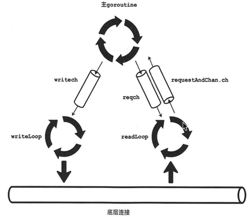

# go http 长链接
* https://www.jianshu.com/p/60fc45a6f9e7

# http + protobuf 编码
* http://www.coder55.com/article/87572

# go 网络相关
## 从 raft-exmaple 中的 startRaft 说明
只保留网络相关代码
```go
func (rc *raftNode) startRaft() {
    // 建立网络连接实例 Transport
	rc.transport = &rafthttp.Transport{
		Logger:      zap.NewExample(),
		ID:          types.ID(rc.id),
		ClusterID:   0x1000,
		Raft:        rc,
		ServerStats: stats.NewServerStats("", ""),
		LeaderStats: stats.NewLeaderStats(strconv.Itoa(rc.id)),
		ErrorC:      make(chan error),
	}
    // 启动网络服务相关组件
    rc.transport.Start()
    // 建立与集群各个节点的连接
	for i := range rc.peers {
		if i+1 != rc.id {
			rc.transport.AddPeer(types.ID(i+1), []string{rc.peers[i]})
		}
	}
    // 启动协程，监听当前节点与集群中其他网络节点的连接
	go rc.serveRaft()
}
```
* serveRaft()
```go
func (rc *raftNode) serveRaft() {
    // 实例化 toppableListener（内嵌了 net.TCPListener） 
	ln, err := newStoppableListener(url.Host, rc.httpstopc)
	if err != nil {
		log.Fatalf("raftexample: Failed to listen rafthttp (%v)", err)
	}

    // 创建 http.Server 实例，绑定 handler
	err = (&http.Server{Handler: rc.transport.Handler()}).Serve(ln)
}
```
1. http.Server 通过传入的 TCPLIStener 监听指定地址上的连接请求
2. 当连接到来时，accept() 方法会创建 net.Conn (网络连接实例)
3. http.Server 为每一个连接启动一个 goroutine 处理连接上的请求，请求逻辑封装在 handler 中

* rafthttp handler()
```go
func (t *Transport) Handler() http.Handler {
    // 三个handler 后边会说明
	pipelineHandler := newPipelineHandler(t, t.Raft, t.ClusterID)
	streamHandler := newStreamHandler(t, t, t.Raft, t.ID, t.ClusterID)
    snapHandler := newSnapshotHandler(t, t.Raft, t.Snapshotter, t.ClusterID)
    // 绑定路由
	mux := http.NewServeMux()
	mux.Handle(RaftPrefix, pipelineHandler)          //    "/raft"
    mux.Handle(RaftStreamPrefix+"/", streamHandler)  //    "/raft/stream/"
	mux.Handle(RaftSnapshotPrefix, snapHandler)      //    "/raft/snapshot"
	mux.Handle(ProbingPrefix, probing.NewHandler())  //    "/raft/probing"   
	return mux
}
```

## RoundTripper
使用golang net/http库发送http请求，最后都是调用 transport的 RoundTrip 方法
```go
type RoundTripper interface {
    RoundTrip(*Request) (*Response, error)
}
```
RoundTrip 代表一个http事务，给一个请求返回一个响应, 看一下实现，对应源文件net/http/transport.go， http 包的精髓，重点字段如下：
```go
type Transport struct {
    // persistConn 是 net.Conn 的一层封装，通常是 TCP 长连接（不调用close关闭的连接）
	idleConn     map[connectMethodKey][]*persistConn // most recently used at end


	// Dial specifies the dial function for creating unencrypted TCP connections.
	//
	// Dial runs concurrently with calls to RoundTrip.
	// A RoundTrip call that initiates a dial may end up using
	// a connection dialed previously when the earlier connection
	// becomes idle before the later Dial completes.
	//
	// Deprecated: Use DialContext instead, which allows the transport
	// to cancel dials as soon as they are no longer needed.
    // If both are set, DialContext takes priority.
    // 负责创建底层 TCP 连接
	Dial func(network, addr string) (net.Conn, error)

	// DisableKeepAlives, if true, disables HTTP keep-alives and
	// will only use the connection to the server for a single
	// HTTP request.
	//
	// This is unrelated to the similarly named TCP keep-alives.
	DisableKeepAlives bool
}
```
* RoundTrip()
```go
    // 从空闲连接池里获取TCP长连接，如果没有就重新创建
    pconn, err := t.getConn(treq, cm)
    // 发起请求
	resp, err = pconn.roundTrip(treq)
	return resp, nil
```
获取了连接，然后就是 pconn.roundTrip(treq)

* 主协程
    * 主goroutine ->requestAndChan -> 读循环goroutine
    * 主goroutine ->writeRequest-> 写循环goroutine
    * 主goroutine 通过select 监听各个channel上的数据， 比如请求取消， timeout，长连接挂了，写流出错，读流出错， 都是其他goroutine 发送过来的， 跟中断一样，然后相应处理，上面也提到了，有些channel是主goroutine通过channel发送给其他goroutine的
* 写Loop
    * select channel中主gouroutine的request，然后写入tcp输入流
* 读Loop
    * 读循环goroutine 通过channel requestAndChan 接受主goroutine发送的request(rc := <-pc.reqch), 并从tcp输出流中读取response， 然后反序列化到结构体中， 最后通过channel 返给主goroutine (rc.ch <- responseAndError{resp, err} )

可以看出来，Transport 相当于实现了连接池的功能，有时间可以深入代码研究以下