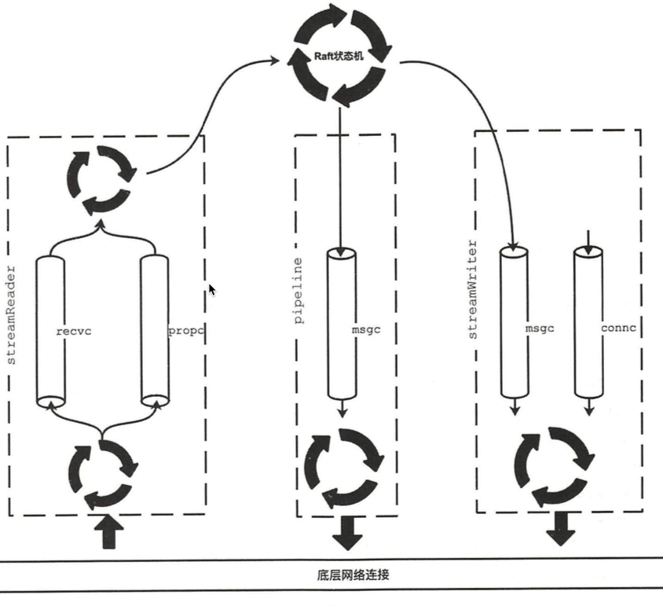
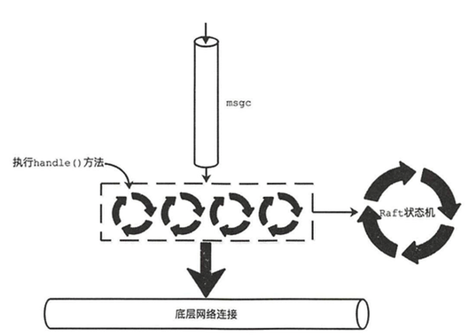
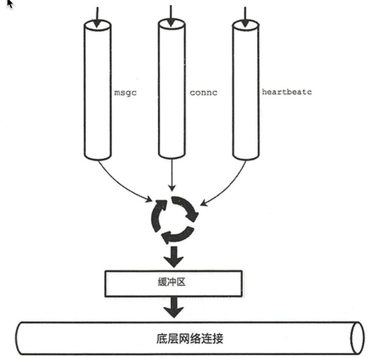

# 核心数据结构
## Transporter
```go
type Transporter interface {
    // 初始化
	Start() error
    // handler
	Handler() http.Handler
    // 发送消息
	Send(m []raftpb.Message)
    // 发送快照数据
	SendSnapshot(m snap.Message)
    // 添加一个新的节点
	AddRemote(id types.ID, urls []string)

    // 以下是对 peer 的操作
	AddPeer(id types.ID, urls []string)
	RemovePeer(id types.ID)
	RemoveAllPeers()
	UpdatePeer(id types.ID, urls []string)
	ActiveSince(id types.ID) time.Time
	ActivePeers() int
	Stop()
}
```
## Raft
```go
type Raft interface {
    // 将指定消息实例传递给底层的 raft
    Process(ctx context.Context, m raftpb.Message) error
    // 检测节点是否已经被移除
    IsIDRemoved(id uint64) bool
    // 通知底层raft，与指定节点无法通信
    ReportUnreachable(id uint64)
    // 通知底层raft 快照数据是否发送成功
	ReportSnapshot(id uint64, status raft.SnapshotStatus)
}
```
## Transport
Transporter 的实现
```go
type Transport struct {
	ID          types.ID   // local member ID
	URLs        types.URLs // local peer URLs
	ClusterID   types.ID   // raft cluster ID for request validation
	Raft        Raft       // raft state machine, to which the Transport forwards received messages and reports status

    // stream 通道使用的 roundtripper 实例
    streamRt   http.RoundTripper // roundTripper used by streams
    // pipeline 通道使用的 roundtripper 实例
	pipelineRt http.RoundTripper // roundTripper used by pipelines

	remotes map[types.ID]*remote // remotes map that helps newly joined member to catch up
	peers   map[types.ID]Peer    // peers map

    // 探测 pipeline 通道是否可用
    pipelineProber probing.Prober
    // 探测 stream 通道是否可用
	streamProber   probing.Prober
}
```

# 主要实现
## Transport.start()
```go
func (t *Transport) Start() error {
    var err error
    // 创建 stream通道使用的 httproundtripper 实例
	t.streamRt, err = newStreamRoundTripper(t.TLSInfo, t.DialTimeout)
    // 创建 pipeline 通道使用的 httproundtripper 实例, 与上边不同的是 读写请求超时时间设置成了永不过期
	t.pipelineRt, err = NewRoundTripper(t.TLSInfo, t.DialTimeout)
	t.remotes = make(map[types.ID]*remote)
    t.peers = make(map[types.ID]Peer)
    // 用于探测两个通道是否可用
	t.pipelineProber = probing.NewProber(t.pipelineRt)
	t.streamProber = probing.NewProber(t.streamRt)

	// If client didn't provide dial retry frequency, use the default
	// (100ms backoff between attempts to create a new stream),
	// so it doesn't bring too much overhead when retry.
	if t.DialRetryFrequency == 0 {
		t.DialRetryFrequency = rate.Every(100 * time.Millisecond)
	}
	return nil
}
``` 

## Transport.Handler() 
前边描述过
```go
func (t *Transport) Handler() http.Handler {
    // 三个handler 后边会说明
	pipelineHandler := newPipelineHandler(t, t.Raft, t.ClusterID)
	streamHandler := newStreamHandler(t, t, t.Raft, t.ID, t.ClusterID)
    snapHandler := newSnapshotHandler(t, t.Raft, t.Snapshotter, t.ClusterID)
    // 绑定路由
	mux := http.NewServeMux()
	mux.Handle(RaftPrefix, pipelineHandler)          //    "/raft"
    mux.Handle(RaftStreamPrefix+"/", streamHandler)  //    "/raft/stream/"
	mux.Handle(RaftSnapshotPrefix, snapHandler)      //    "/raft/snapshot"
	mux.Handle(ProbingPrefix, probing.NewHandler())  //    "/raft/probing"   
	return mux
}
```

## AddPeer()
创建并弃用对应节点的 Peer 实例
```go
func (t *Transport) AddPeer(id types.ID, us []string) {
	urls, err := types.NewURLs(us)
    // 启动
    t.peers[id] = startPeer(t, urls, id, fs)
    // 每个一段时间通过两个通道向对端探测消息
	addPeerToProber(t.Logger, t.pipelineProber, id.String(), us, RoundTripperNameSnapshot, rttSec)
	addPeerToProber(t.Logger, t.streamProber, id.String(), us, RoundTripperNameRaftMessage, rttSec)
}
```

## Send()
```go
func (t *Transport) Send(msgs []raftpb.Message) {
	for _, m := range msgs {  // 遍历 msg全部消息
		to := types.ID(m.To)

		t.mu.RLock()
		p, pok := t.peers[to]
		g, rok := t.remotes[to]
		t.mu.RUnlock()

		if pok {  // 如果存在对应的实例
			if m.Type == raftpb.MsgApp {
				t.ServerStats.SendAppendReq(m.Size())
            }
            // 通过 peer 发送消息
			p.send(m)
			continue
		}
	}
}
```

##  Peer 接口
上面send的实现可以看出来，真正发送数据是通过 peer 完成的
```go
type Peer interface {
    // 发送单个消息，如果失败会报告给底层raft
	send(m raftpb.Message)
	// sendSnap sends the merged snapshot message to the remote peer. Its behavior
	// is similar to send.
	sendSnap(m snap.Message)
	// update updates the urls of remote peer.
	update(urls types.URLs)

	// attachOutgoingConn attaches the outgoing connection to the peer for
	// stream usage. After the call, the ownership of the outgoing
	// connection hands over to the peer. The peer will close the connection
	// when it is no longer used.
	attachOutgoingConn(conn *outgoingConn)
	// activeSince returns the time that the connection with the
	// peer becomes active.
	activeSince() time.Time
	// stop performs any necessary finalization and terminates the peer
	// elegantly.
	stop()
}
```
Peer 接口的实现 
```go
type peer struct {
	// id of the remote raft peer node
	id types.ID

	r Raft
    // 每个节点提供多个url，如果失败尝试访问另一个
	picker *urlPicker

    // 从 Stream 通道写入消息
    msgAppV2Writer *streamWriter
    writer         *streamWriter
    // pipeline 消息通道
	pipeline       *pipeline
	snapSender     *snapshotSender // snapshot sender to send v3 snapshot messages
    // 从 Stream 通道读取消息
	msgAppV2Reader *streamReader
	msgAppReader   *streamReader

    // 从 stream 通道读取消息后会通过该通道交给 Raft接口 返回给底层raft·
	recvc chan raftpb.Message
    // 从 stream 通道读取 MsgProp 消息后会通过该通道交给 Raft接口 返回给底层raft·
	propc chan raftpb.Message
}
```
!

### peer.startPeer()
初始化上边的字段，以及启动后台协程
```go
func startPeer(t *Transport, urls types.URLs, peerID types.ID, fs *stats.FollowerStats) *peer {
	status := newPeerStatus(t.Logger, t.ID, peerID)
	picker := newURLPicker(urls)
	errorc := t.ErrorC
    r := t.Raft
    // 创建pipeline 实例
	pipeline := &pipeline{
		peerID:        peerID,
		tr:            t,
		picker:        picker,
		status:        status,
		followerStats: fs,
		raft:          r,
		errorc:        errorc,
    }
    // 启动 pipeline
	pipeline.start()

    // 创建 peer 实例
	p := &peer{
		lg:             t.Logger,
		localID:        t.ID,
		id:             peerID,
		r:              r,
		status:         status,
        picker:         picker,
        // 创建并启动 streamwriter
		msgAppV2Writer: startStreamWriter(t.Logger, t.ID, peerID, status, fs, r),
		writer:         startStreamWriter(t.Logger, t.ID, peerID, status, fs, r),
		pipeline:       pipeline,
		snapSender:     newSnapshotSender(t, picker, peerID, status),
		recvc:          make(chan raftpb.Message, recvBufSize),
		propc:          make(chan raftpb.Message, maxPendingProposals),
		stopc:          make(chan struct{}),
	}

	ctx, cancel := context.WithCancel(context.Background())
    p.cancel = cancel
    // 启动单独协程，负责读取recvc通道的消息（从对端发送过来的），并交给底层raft
	go func() {
		for {
			select {
			case mm := <-p.recvc:
				if err := r.Process(ctx, mm); err != nil {
				}
			case <-p.stopc:
				return
			}
		}
	}()

	// r.Process might block for processing proposal when there is no leader.
	// Thus propc must be put into a separate routine with recvc to avoid blocking
    // processing other raft messages.
    // 启动单独协程，负责读取 propc 通道的MsgProc消息，并交给底层raft
	go func() {
		for {
			select {
			case mm := <-p.propc:
				if err := r.Process(ctx, mm); err != nil {
					plog.Warningf("failed to process raft message (%v)", err)
				}
			case <-p.stopc:
				return
			}
		}
	}()

    // 创建 streamReader 实例
	p.msgAppV2Reader = &streamReader{
		lg:     t.Logger,
		peerID: peerID,
		typ:    streamTypeMsgAppV2,
		tr:     t,
		picker: picker,
		status: status,
		recvc:  p.recvc,
		propc:  p.propc,
		rl:     rate.NewLimiter(t.DialRetryFrequency, 1),
	}
	p.msgAppReader = &streamReader{
		lg:     t.Logger,
		peerID: peerID,
		typ:    streamTypeMessage,
		tr:     t,
		picker: picker,
		status: status,
		recvc:  p.recvc,
		propc:  p.propc,
		rl:     rate.NewLimiter(t.DialRetryFrequency, 1),
	}
    // 启动 streamreader
	p.msgAppV2Reader.start()
	p.msgAppReader.start()

	return p
}
```
### peer.Send()
```go
func (p *peer) send(m raftpb.Message) {
    // 根据消息类型选择合适的通道，后边会说明
	writec, name := p.pick(m)
	select {
    // 将msg写入 writec通道,等待发送
	case writec <- m:
	default:
		// 异常处理
	}
}
```

### peer.pick()
根据消息类型选择是 pipeline 的通道还是 stream消息通道
```go
func (p *peer) pick(m raftpb.Message) (writec chan<- raftpb.Message, picked string) {
	var ok bool
	// Considering MsgSnap may have a big size, e.g., 1G, and will block
	// stream for a long time, only use one of the N pipelines to send MsgSnap.
	if isMsgSnap(m) {
		return p.pipeline.msgc, pipelineMsg
	} else if writec, ok = p.msgAppV2Writer.writec(); ok && isMsgApp(m) {
		return writec, streamAppV2
	} else if writec, ok = p.writer.writec(); ok {
		return writec, streamMsg
	}
	return p.pipeline.msgc, pipelineMsg
}
```

## Pipeline
```go
type pipeline struct {
	peerID types.ID

	tr     *Transport
	picker *urlPicker
	status *peerStatus
	raft   Raft
    //从该通道获取待发送的消息
	msgc chan raftpb.Message
    // wait for the handling routines
    // 同步多个goroutine的结束，每个pipeline会启动多个协程来处理 msgc通道的消息
	wg    sync.WaitGroup
	stopc chan struct{}
}
```


* pipeline.start()：
    1. 创建 msgc 通道
    2. 创建发送消息的协程
        * 读取 msgc 消息
        * P.Post(）讲消息序列化然后通过 http请求发送 

* Post()
```go
func (p *pipeline) post(data []byte) (err error) {
    u := p.picker.pick()
    // pb 格式序列化
	req := createPostRequest(u, RaftPrefix, bytes.NewBuffer(data), "application/protobuf", p.tr.URLs, p.tr.ID, p.tr.ClusterID)
 
    ... 
    // 发送 post 请求
	resp, err := p.tr.pipelineRt.RoundTrip(req)

	return nil
}
```

## StreamWriter
主要工作就是向 stream通道写入消息
```go
type streamWriter struct {
	localID types.ID
	peerID  types.ID
	r      Raft

	mu      sync.Mutex // guard field working and closer
    closer  io.Closer
    // 表示当前 streamWriter 是否可用
	working bool
    // 从该通道读取消息然后发送出去
    msgc  chan raftpb.Message
    // 通过该通道获取关联的底层连接
	connc chan *outgoingConn
}
```


* streamWriter.
```go
func startStreamWriter(lg *zap.Logger, local, id types.ID, status *peerStatus, fs *stats.FollowerStats, r Raft) *streamWriter {
	w := &streamWriter{
		lg: lg,

		localID: local,
		peerID:  id,

		status: status,
		fs:     fs,
		r:      r,
		msgc:   make(chan raftpb.Message, streamBufSize),
		connc:  make(chan *outgoingConn),
		stopc:  make(chan struct{}),
		done:   make(chan struct{}),
    }
    /* 
    1. 当其他节点主动与该节点创建连接，连接写入到 connc 通道，之后使用该连接发送消息
    2. 定时发送心跳，防止底层连接超时断开（非raft心跳）
    3. 发送心跳外的其他类型消息
    */
	go w.run()
	return w
}
```
