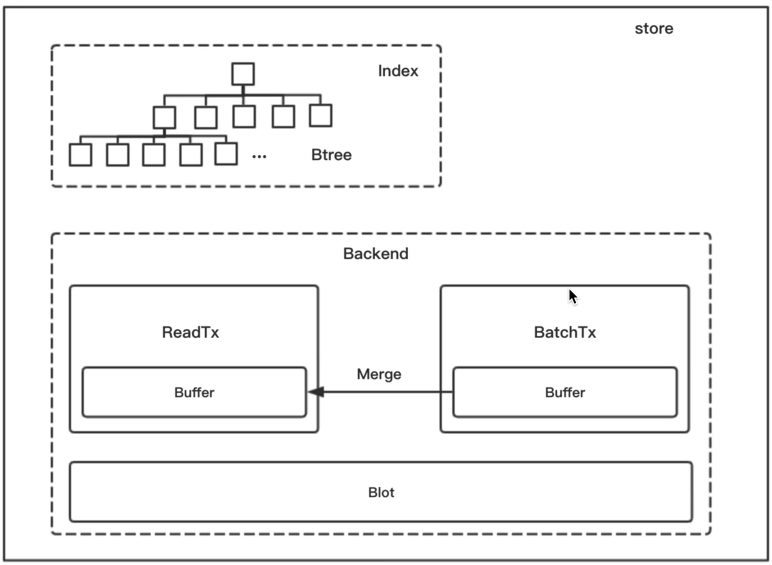
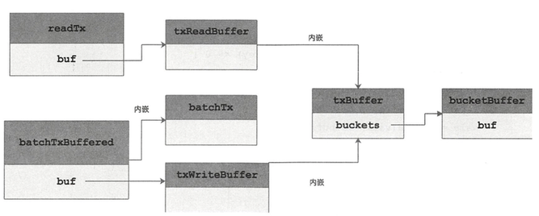
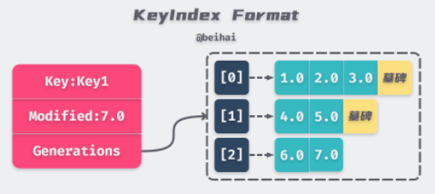
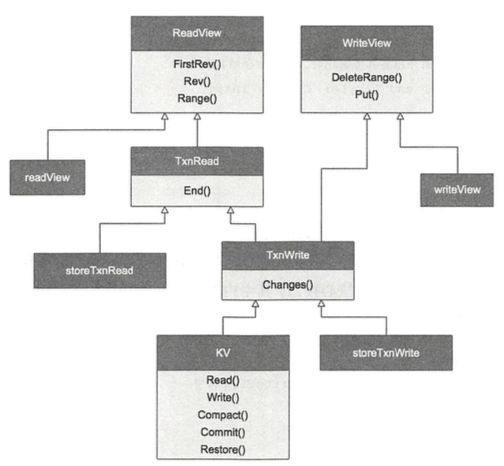
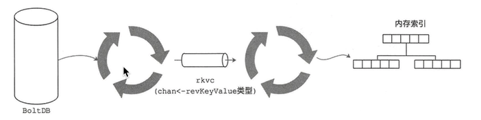

# 1. mvcc（状态机存储）概述
## 1.1 并发控制
在数据库领域，并发控制是一个很具有挑战性的话题。常见的并发控制方式包括悲观锁、乐观锁和多版本并发控制。但是无论是悲观锁还是乐观锁，它们都不是真正的锁概念，而是用来描述锁类别的『设计思想』。

## 1.2 悲观锁
悲观并发控制（又称悲观锁）指的是对数据竞争持悲观消极的态度，默认数据被外界访问时，必然会产生冲突，所以在数据处理的整个过程中会对数据加各种锁来实现并发控制，保证同一时间只有一个线程可以访问到数据。如果一个事务执行过程中对某行数据应用了锁，那么只有在这个事务将锁释放之后，其他事务才能够执行与该锁冲突的操作。由于加锁机制是一种预防性的版本控制，读操作会阻塞写操作，写操作也会阻塞读操作，当锁的粒度较大、时间较长时并发性能就比较差，主要用于数据竞争激烈、写多读少的并发环境。

## 1.3 乐观锁
乐观并发控制（又称乐观锁）是相对悲观锁而言，假设多用户并发的事务在处理时彼此之间不会互相影响，所以不会对数据加锁。在提交更新的数据之前，每个事务都会检查在该事务读取数据之后，有没有其它事务又修改了该数据。如果有其它事务对数据进行了修改，那么正在提交的事务会进行回滚。乐观锁多用于数据冲突较少的环境，偶尔回滚事务的成本要比读取数据时锁定数据的成本低很多，在这种情况下乐观锁可以获得更高的吞吐量。

## 1.4 MVCC
多版本并发控制（Multi-Version Concurrency Control , MVCC）是一种无锁事务机制，可以把 MVCC 理解为乐观并发控制思想的一种实现方法，它能够与悲观锁很好地结合以增加事务的并发量。MVCC 的每一个写操作都会创建一个新版本的数据，读操作会从有限多个版本的数据中挑选一个最合适（要么是最新版本，要么是指定版本）的结果直接返回 。通过这种方式，我们就不需要关注读写操作之间的数据冲突。因此，如何管理和高效地选取数据的版本就成了 MVCC 需要解决的主要问题。

# 2. 核心数据结构
由于存在较多的数据结构，这里简述一下其之间的关系, ()里的结构是其接口
```go
//可以管理 watcher 实例的 store，这层封装目的是所有的更改在进入 store 存储的过程中会把变更记录，并把记录给watcher对象
watchableStore
{
    *store // 内嵌了 store
    WatchStream()
}

// mvcc.store 相关，对外提供服务的接口
store(kv)
{
	ReadView    // 只读事物视图(kv 内嵌了该结构)
	WriteView   //读写事物视图 (kv 内嵌了该结构)
	b       backend.Backend  // 后端存储相关
	kvindex index(treeindex)  // 索引相关
	le lease.Lessor  // 租约相关
}

// backend 索引相关
treeIndex(Index)  BTree 索引树，用来找 key 对应的 KeyIndex, 内存维护

keyIndex
{
    generation
}

// backend store 相关
backend(Backend)  // 底层存储与上层解耦
{
    readTx(ReadTx)  // 只读事务
    batchTx(BatchTx) // 读写事务
    {
        ReadTx // 内嵌了 ReadTx
    }
    db *bolt.DB  // 底层持久化数据库


}
```
# 3. boltdb 使用简介
## 3.1 简述
* mmap
* 通过COW（写时复制）技术，可实现无锁的读写并发，但是无法实现无锁的写写并发，这就注定了读性能超高，但写性能一般，适合与读多写少的场景。
* B+树（只有叶子节点存数局，可以增大路数（同样大小的磁盘块装的路数更多））
* ACID 事务

## 3.2 几个概念
* DB 数据库中所有的 bucket集合
* bucket 键值对集合（类比表）, key 是按顺序排列的
* Tx 只读或者读写事务
* Cursor 迭代器，顺序遍历 bucket 所有的键值对

## 3.3 使用
* 无论添加、删除、读取都需要打开数据库文件，并获取一个事务。
* 打开数据库（带文件锁，不能多进程同时打开同一数据库）
* 读写事务 Update()
* 只读事务 View()
* 批量更新 Batch()
* Begin() Commit()

# 4 store 整体架构简图


put 数据时


# 5 索引（index）与底层存储（backend）
## 5.1 reversion
reversion 主要由两部分组成， 第一部分是 main reversion，每次事务递增一；第二部分是 sub reversion，同一个事务的每次操作都会递增一，两者结合就可以保证 Key 唯一且递增。
```shell
rev={1 0}, key=key1, value="valuel" 
rev={1 1}, key=key2, value="value2" 
rev={2 0}, key=key1, value="updatel"
rev={2 1}, key=key2, value="update2"
```
reversion 才是真正底层存储的可以，value是（用户角度的 key value）

## 5.2 Backend 存储的实现
从 Backend 保存的数据格式我们可以看出，如果要从 BoltDB 中查询键值对，必须通过 reversion 进行查找。
```go
type Backend interface {
    ReadTx() ReadTx           // 只读事务，已经被 ConcurrentReadTx() 取代，
    BatchTx() BatchTx         // 读写事务（批量事务）
    ConcurrentReadTx() ReadTx // 非阻塞的只读事务，代替了 ReadTx()，详情见 PR#10523
    Snapshot() Snapshot       // 创建快照
    Hash(ignores map[IgnoreKey]struct{}) (uint32, error)
    Size() int64
    SizeInUse() int64
    OpenReadTxN() int64       // 返回当前正在进行的只读事务数量
    Defrag() error            // 碎片整理
    ForceCommit()             // 提交批量读写事务
    Close() error
}
```
Backend 两个重要的概念是 ReadTx 和 BatchTx，分别实现了只读事务和读写事务的接口，其中BatchTx内嵌了ReadTx，“继承“了只读事务实现的方法
```go
type ReadTx interface {
    Lock()
    Unlock()
    RLock()
    RUnlock()
    // 指定的 bucket中进行范围查找
    UnsafeRange(bucketName []byte, key, endKey []byte, limit int64) (keys [][]byte, vals [][]byte)
    // 遍历指定的 bucket中所有键值对
    UnsafeForEach(bucketName []byte, visitor func(k, v []byte) error) error
}

type BatchTx interface {
    ReadTx
    // 创建 bucket
    UnsafeCreateBucket(name []byte)
    // 向 bucket 添加键值对
    UnsafePut(bucketName []byte, key []byte, value []byte)
    UnsafeSeqPut(bucketName []byte, key []byte, value []byte)
    // 向 bucket 删除键值对
    UnsafeDelete(bucketName []byte, key []byte)
    Commit()        // 提交当前的读写事务，并立即打开一个新的读写事务
    CommitAndStop() // 提交当前的读写事务，但是不会打开新的读写事务
}
```

### 5.2.1 backend 实现
```go
type backend struct {
    // db 总使用字节数
	size int64
	// sizeInUse is the number of bytes actually used in the backend
	sizeInUse int64
	// commits counts number of commits since start
	commits int64
	// openReadTxN is the number of currently open read transactions in the backend
	openReadTxN int64

    mu sync.RWMutex
    // 底层的db存储
	db *bolt.DB

	batchInterval time.Duration
    batchLimit    int
    // 添加了缓存功能的批量读写事务
	batchTx       *batchTxBuffered

    // 实现了只读事务的结构
	readTx *readTx

	stopc chan struct{}
	donec chan struct{}

	lg *zap.Logger
}
```
### 5.2.2 初始化 backend
```go
func newBackend(bcfg BackendConfig) *backend {
    // 初始化 db 参数
	bopts := &bolt.Options{}
    //打开数据库
    db, err := bolt.Open(bcfg.Path, 0600, bopts)

    // 实例化 backend
	b := &backend{
		db: db,

		batchInterval: bcfg.BatchInterval,
		batchLimit:    bcfg.BatchLimit,

		readTx: &readTx{
			buf: txReadBuffer{
				txBuffer: txBuffer{make(map[string]*bucketBuffer)},
			},
			buckets: make(map[string]*bolt.Bucket),
			txWg:    new(sync.WaitGroup),
		},

		stopc: make(chan struct{}),
		donec: make(chan struct{}),

		lg: bcfg.Logger,
    }
    // 创建带缓存的读写事务实例
    b.batchTx = newBatchTxBuffered(b)
    // 启动单独协程，定时提交当前批量读写事务，并开启新的事务
	go b.run()
	return b
}
```
```go
func (b *backend) run() {
    defer close(b.donec)
    //  创建定时器
	t := time.NewTimer(b.batchInterval)
	defer t.Stop()
	for {
        // 阻塞等待定时器到期
		select {
		case <-t.C:
		case <-b.stopc:
			b.batchTx.CommitAndStop()
			return
        }
        // 提交当前读写事务，并起一个新的批量读写事务
		if b.batchTx.safePending() != 0 {
			b.batchTx.Commit()
        }
        // 重置定时器
		t.Reset(b.batchInterval)
	}
}
```
### 5.2.3 获得快照
```go
func (b *backend) Snapshot() Snapshot {
    // 提交当前读写事务，目的是提交缓冲期的熬做
	b.batchTx.Commit()

    // 开启一个只读事务
	tx, err := b.db.Begin(false)

    stopc, donec := make(chan struct{}), make(chan struct{})
    // Size returns current database size in bytes as seen by this transaction.
    dbBytes := tx.Size()
    // 单独启动协程判断快照是否产生完成
	go func() {
        ...
	}()
    // 返回快照实例，通过后续 tx.WriteTO()
	return &snapshot{tx, stopc, donec}
}
```

### 5.2.4 defrag() 清理碎片
就是新建数据库文件，把旧的拷贝过来

## 5.3 读写事务和只读事务
主要就是前边的 readtx batchtx，先说明一下 key 的查询过程：
* 根据key，在索引中查到Revision（利用BTree）
* 根据Revision，在Backend的缓存中查找
* 若缓存中不符合条件，在BlotDB中查找（Blot自己的索引）
因此 readtx 是待缓存的，写事务的时候也会先merge数据到读缓存上

### 5.3.1 只读事务
```go
type readTx struct {
	// mu protects accesses to the txReadBuffer
	mu  sync.RWMutex
	buf txReadBuffer

	// TODO: group and encapsulate {txMu, tx, buckets, txWg}, as they share the same lifecycle.
	// txMu protects accesses to buckets and tx on Range requests.
	txMu    sync.RWMutex
	tx      *bolt.Tx
	buckets map[string]*bolt.Bucket
	// txWg protects tx from being rolled back at the end of a batch interval until all reads using this tx are done.
	txWg *sync.WaitGroup
}
```
* 范围查找
```go
func (rt *readTx) UnsafeRange(bucketName, key, endKey []byte, limit int64) ([][]byte, [][]byte) {
    // 如果没有指定 endkey，言为之意就只有key这一个结果
	if endKey == nil {
		// forbid duplicates for single keys
		limit = 1
	}
	if limit <= 0 {
		limit = math.MaxInt64
	}
    // 先从缓存里读，缓存的结构下边会说明
    keys, vals := rt.buf.Range(bucketName, key, endKey, limit)
    // 如果缓存读出来的数量 打到 limit 的数量，直接返回
	if int64(len(keys)) == limit {
		return keys, vals
	}
	rt.txMu.Lock()
	c := bucket.Cursor()
	rt.txMu.Unlock()
    // 从 bolddb里查询，
	k2, v2 := unsafeRange(c, key, endKey, limit-int64(len(keys)))
	return append(k2, keys...), append(v2, vals...)
}
```
* readtx 和 batchtx 的缓存

最终缓存的结构是 txBuffer
```go
type txBuffer struct {
    // key 是bucket名称
	buckets map[string]*bucketBuffer
}
// bucketBuffer buffers key-value pairs that are pending commit.
type bucketBuffer struct {
    // kv 类型,  有序的key，可以先二分查找，在往后遍历做范围查询
	buf []kv
    // used tracks number of elements in use so buf can be reused without reallocation.
    // 当前的下标
	used int
}
```
### 5.3.2 读写事务 batchtx
```go
type batchTx struct {
	sync.Mutex
	tx      *bolt.Tx
	backend *backend

    // 当前事务中执行的修改操作个数，读写事务提交时该值会被重置为 0
	pending int
}
//带缓存的， backend使用了带缓存的
type batchTxBuffered struct {
    batchTx
    // 写事务会同时更新 boltdb 和 缓存，同时还会把缓存写到只读事务的缓存中
	buf txWriteBuffer
}
```
* batchTx的写入删除操作实现也很简单，只是调用了 BoltDB 提供的 API 修改 Bucket 中的数据，这方面的内容也不再赘述。
* 由于 BoltDB 长时间执行读写事务，会导致其他读写事务挂起等待，因此 Backend 指定了一次读写事务中最大的操作数，当超过该阈值时，当前的读写事务会自动提交。

## 5.4 backend 索引实现
* 上文说过为了实现多版本引入了reversion概念，带来的问题就是需要维护映射关系，原始key->reversion，这样才能查询
* 这个映射关系被维护在 Btree 里， Btree 存的值是 KeyIndex，通过该结构找到reversion，进而去 backend 查询
* 我们想要查原始key对应的值时，可以指定Revision开始查询(如果不指定，默认从最新开始查询)

### 5.4.1 treeIndex(btree)
```go
// 对 btree的一层封装
type index interface {
	Get(key []byte, atRev int64) (rev, created revision, ver int64, err error)
	Range(key, end []byte, atRev int64) ([][]byte, []revision)
	Revisions(key, end []byte, atRev int64) []revision
	Put(key []byte, rev revision)
	Tombstone(key []byte, rev revision) error
	RangeSince(key, end []byte, rev int64) []revision
	Compact(rev int64) map[revision]struct{}
	Keep(rev int64) map[revision]struct{}
	Equal(b index) bool

	Insert(ki *keyIndex)
	KeyIndex(ki *keyIndex) *keyIndex
}

type treeIndex struct {
    sync.RWMutex
    // google 开源的 btree
	tree *btree.BTree
	lg   *zap.Logger
}
```
### 5.4.2 keyIndex

```go
type keyIndex struct {
	key         []byte
	modified    revision // the main rev of the last modification
	generations []generation
}
```

## 5.5 store mvcc 对外提供整套功能的封装
store 是对 KV 接口的实现

```go
type KV interface {
	ReadView
	WriteView

	// Read creates a read transaction.
	Read(trace *traceutil.Trace) TxnRead

	// Write creates a write transaction.
	Write(trace *traceutil.Trace) TxnWrite

	// Hash computes the hash of the KV's backend.
	Hash() (hash uint32, revision int64, err error)

	// HashByRev computes the hash of all MVCC revisions up to a given revision.
	HashByRev(rev int64) (hash uint32, revision int64, compactRev int64, err error)

	// Compact frees all superseded keys with revisions less than rev.
	Compact(trace *traceutil.Trace, rev int64) (<-chan struct{}, error)

	// Commit commits outstanding txns into the underlying backend.
	Commit()

	// Restore restores the KV store from a backend.
	Restore(b backend.Backend) error
	Close() error

type store struct {
	ReadView
	WriteView

	// consistentIndex caches the "consistent_index" key's value. Accessed
	// through atomics so must be 64-bit aligned.
	consistentIndex uint64

	cfg StoreConfig

	// mu read locks for txns and write locks for non-txn store changes.
	mu sync.RWMutex

	ig ConsistentIndexGetter

	b       backend.Backend
	kvindex index

	le lease.Lessor

	// revMuLock protects currentRev and compactMainRev.
	// Locked at end of write txn and released after write txn unlock lock.
	// Locked before locking read txn and released after locking.
	revMu sync.RWMutex
	// currentRev is the revision of the last completed transaction.
	currentRev int64
	// compactMainRev is the main revision of the last compaction.
	compactMainRev int64

	// bytesBuf8 is a byte slice of length 8
	// to avoid a repetitive allocation in saveIndex.
	bytesBuf8 []byte

	fifoSched schedule.Scheduler

	stopc chan struct{}

	lg *zap.Logger
}
```
这里只分析两个接口
* 用于查询的 rangeKeys()
```go
func (tr *storeTxnRead) rangeKeys(key, end []byte, curRev int64, ro RangeOptions) (*RangeResult, error) {
    rev := ro.Rev
    // 检查指定的revision信息是否合法
    ...
    // 从 btree 返回指定的键值的 reversion 信息
	revpairs := tr.s.kvindex.Revisions(key, end, rev)
	tr.trace.Step("range keys from in-memory index tree")
    ...

    // 遍历查询到的 reversion 信息
	for i, revpair := range revpairs[:len(kvs)] {
        // 拆分 reversion 成 main 和 sub
        revToBytes(revpair, revBytes)
        // 从 boltdb 查询(有缓存)
		_, vs := tr.tx.UnsafeRange(keyBucketName, revBytes, nil, 0)
        // 反序列化后存到 kvs
		if err := kvs[i].Unmarshal(vs[0]); err != nil {
			if tr.s.lg != nil {
				tr.s.lg.Fatal(
					"failed to unmarshal mvccpb.KeyValue",
					zap.Error(err),
				)
			} else {
				plog.Fatalf("cannot unmarshal event: %v", err)
			}
		}
	}
    tr.trace.Step("range keys from bolt db")
    // 返回结果
	return &RangeResult{KVs: kvs, Count: len(revpairs), Rev: curRev}, nil
}
```

* restore()
从快照恢复状态，包括 treeIndex

1. 从 boltdb 读取所有键值数据，封装成 revKeyValue 实例，写入一个通道
2. 另一个协程读取通道恢复数据

```go
type revKeyValue struct {
	key  []byte   // boltdb 中存放的key值
	kv   mvccpb.KeyValue // boltdb 中存放的key值 
	kstr string // 原始key值
}
```

# 参考
* https://wingsxdu.com/post/database/etcd/#%E7%8A%B6%E6%80%81%E6%9C%BA%E5%AD%98%E5%82%A8&gsc.tab=0 
* https://segmentfault.com/a/1190000021787011
