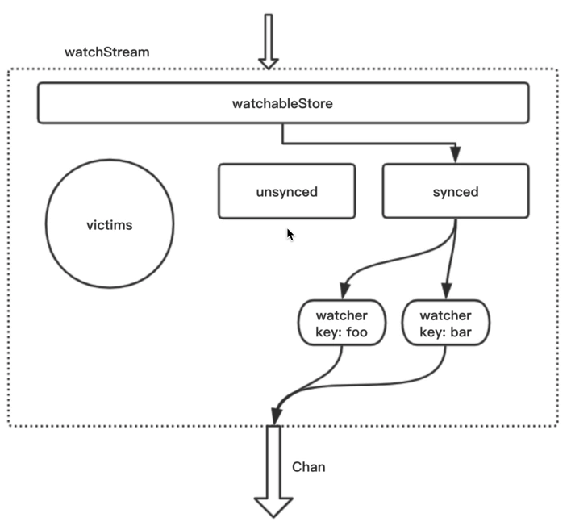
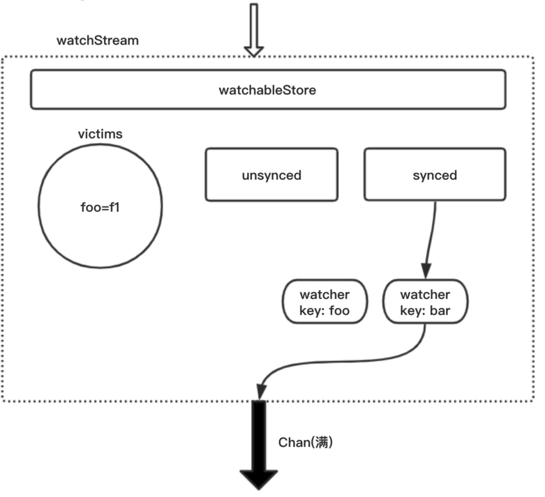
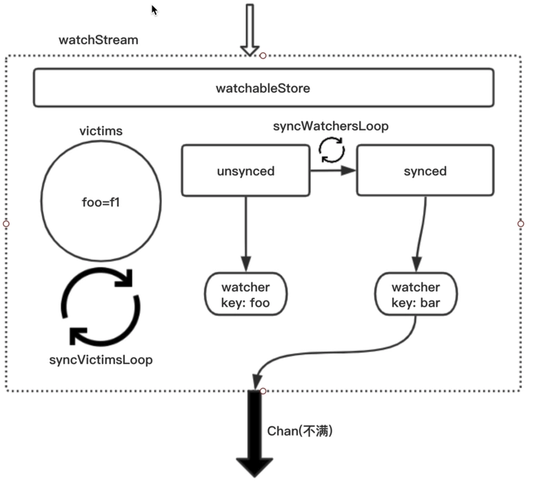

# 概述
watch用于监听指定key或指定key前缀的键值对的变动，key的任何变化都会发出消息。某种意义上讲，这就是发布订阅模式。

## watch模块使用方式
```go
func testWatch() {
    s := newWatchableStore()
    
    w := s.NewWatchStream()
    
    w.Watch(start_key: foo, end_key: nil)
    
    w.Watch(start_key: bar, end_key: nil)
    
    for {
        consume := <- w.Chan()
    }
}
```

# 实现
mvcc 的时候学习了 store 结构体，他可以对数据进行持久化，但是没有wwatcher的功能，etcd 对其又进行了一层封装 名为 watchableStore，重写了store的write方法

## 总体架构

watchableStore收到了所有key的变更后，将这些key交给synced（watchGroup），synced能够快速地从所有key中找到监听的key。将这些key发送给对应的watcher，这些watcher再通过chan将变更信息发送出去。


假设此时有一个写操作：foo=f1。而正好Chan此时刚满，则监听foo的watcher将从synced中踢出，同时foo=f1被保存到victims中
* 队列不满，watcher将这个Event发出后。该watcher就被划入了unsycned中，同时不再是受损状态。
* 由于在受损状态下，这个watcher已经错过了很多消息。为了追回进度，协程会根据watcher保存的Revision，找出受损之后所有的消息，将关于foo的消息全部给watcher，当watcher将这些消息都发送出去后。watcher就脱离了unsynced，成为了synced。



## 重要结构体
### Watcher
watcher监听一个或一组key，如果有变更，watcher将变更内容通过chan发送出去。
```go
type watcher struct {
    // 原始 key
    key []byte
    // 如果有值，则监听的是一个范围
	end []byte

    // 通道拥挤时，字段为true
	victim bool

	// compacted is set when the watcher is removed because of compaction
	compacted bool

	// restore is true when the watcher is being restored from leader snapshot
	// which means that this watcher has just been moved from "synced" to "unsynced"
	// watcher group, possibly with a future revision when it was first added
	// to the synced watcher
	// "unsynced" watcher revision must always be <= current revision,
	// except when the watcher were to be moved from "synced" watcher group
	restore bool

    // minRev is the minimum revision update the watcher will accept
    // 小于这个reverion的更新不会触发
	minRev int64
	id     WatchID

    // 过滤器，触发的event事件需要经过过滤器封装后响应
	fcs []FilterFunc
	// a chan to send out the watch response.
    // The chan might be shared with other watchers.
	ch chan<- WatchResponse
}
```
### WatcherGroup
一组watcher。watcherGroup管理多个watcher，能够根据key快速找到监听该key的一个或多个watcher。
```go
type watcherGroup struct {
    // 监听单个key的 watcher 实例
	keyWatchers watcherSetByKey
    // ranges has the watchers that watch a range; it is sorted by interval
    // 线段树，记录进行范围监听的watcher
	ranges adt.IntervalTree
    // watchers is the set of all watchers
	watchers watcherSet
}
```
### EVENT
变更的消息是以Event的形式发送出去的，Event包括KeyValue，同时包括操作类型（Put、Delete等）
```go
type Event struct {
    // 更新或者删除
	Type Event_EventType `protobuf:"varint,1,opt,name=type,proto3,enum=mvccpb.Event_EventType" json:"type,omitempty"`
    //发生事件之后的数据
	Kv *KeyValue `protobuf:"bytes,2,opt,name=kv" json:"kv,omitempty"`
    // 发生事件之前的数据
	PrevKv *KeyValue `protobuf:"bytes,3,opt,name=prev_kv,json=prevKv" json:"prev_kv,omitempty"`
}
```
### WatchResponse
```go
type WatchResponse struct {
	// WatchID is the WatchID of the watcher this response sent to.
	WatchID WatchID
    // 触发事件的集合
	Events []mvccpb.Event

    // response 创建时的 revision
	Revision int64
	// CompactRevision is set when the watcher is cancelled due to compaction.
	CompactRevision int64
}
```
### watchableStore 
继承自store，在store基础上实现了watch功能。watchableStore管理着两个watcherGroup：synced、unsynced，和一个用于缓存的victims。victims是缓存当前未发出去的Event
```go
type watchableStore struct {
    // 内嵌的 store
	*store

	// mu protects watcher groups and batches. It should never be locked
	// before locking store.mu to avoid deadlock.
	mu sync.RWMutex

    victims []watcherBatch
    // 信号通道
	victimc chan struct{}
	unsynced watcherGroup
	synced watcherGroup

	stopc chan struct{}
	wg    sync.WaitGroup
}
```

### WatchStream 
watchStream是对watchableStore的封装。因为watchableStore继承自store，所以他实现了很多方法，但这些方法并不都是用于Watch功能。所以watchStream对watchableStore再次封装，暴露出与Watch有关的方法。
```go
type WatchStream interface {
	Watch(id WatchID, key, end []byte, startRev int64, fcs ...FilterFunc) (WatchID, error)

    // Chan returns a chan. All watch response will be sent to the returned chan.
    // watcher 发送的通道
	Chan() <-chan WatchResponse
	RequestProgress(id WatchID)
	Cancel(id WatchID) error
	Close()
	// Rev returns the current revision of the KV the stream watches on.
	Rev() int64
}

type watchStream struct {
	watchable watchable
	ch        chan WatchResponse

	mu sync.Mutex // guards fields below it
	// nextID is the ID pre-allocated for next new watcher in this stream
	nextID   WatchID
	closed   bool
	cancels  map[WatchID]cancelFunc
	watchers map[WatchID]*watcher
}
```

### 初始化 newWatchableStore
```go
func newWatchableStore(lg *zap.Logger, b backend.Backend, le lease.Lessor, as auth.AuthStore, ig ConsistentIndexGetter, cfg StoreConfig) *watchableStore {
	s := &watchableStore{
		store:    NewStore(lg, b, le, ig, cfg),
        victimc:  make(chan struct{}, 1),
        // 创建两个 watchergroup
		unsynced: newWatcherGroup(),
		synced:   newWatcherGroup(),
		stopc:    make(chan struct{}),
	}
	s.store.ReadView = &readView{s}
	s.store.WriteView = &writeView{s}
    s.wg.Add(2)
    // 触发两个协程，处理usync和victims的
	go s.syncWatchersLoop()
	go s.syncVictimsLoop()
	return s
}
```
### NewWatchStream 
```go
func (s *watchableStore) NewWatchStream() WatchStream {
	watchStreamGauge.Inc()
	return &watchStream{
        watchable: s,
        // 初始化watch通道
		ch:        make(chan WatchResponse, chanBufLen),
		cancels:   make(map[WatchID]cancelFunc),
		watchers:  make(map[WatchID]*watcher),
	}
}

```
### watchStream.Watch()
```go
// Watch creates a new watcher in the stream and returns its WatchID.
func (ws *watchStream) Watch(id WatchID, key, end []byte, startRev int64, fcs ...FilterFunc) (WatchID, error) {
	ws.mu.Lock()
	defer ws.mu.Unlock()
    // 生成 watcher 实例唯一表示
	if id == AutoWatchID {
		for ws.watchers[ws.nextID] != nil {
			ws.nextID++
		}
		id = ws.nextID
		ws.nextID++
	} else if _, ok := ws.watchers[id]; ok {
		return -1, ErrWatcherDuplicateID
	}

    // 调用watchable.watch 下边会描述重点关注参数
    // starRev 指定了监听的起始 reversion（历史变化也返回），如果小于0，则表示从当前reversion开始监听
	w, c := ws.watchable.watch(key, end, startRev, id, ws.ch, fcs...)

	ws.cancels[id] = c
	ws.watchers[id] = w
	return id, nil
}
```

### watchableStore.Watch()
```go
func (s *watchableStore) watch(key, end []byte, startRev int64, id WatchID, ch chan<- WatchResponse, fcs ...FilterFunc) (*watcher, cancelFunc) {
    // 实例化watcher
	wa := &watcher{
		key:    key,
		end:    end,
		minRev: startRev,
		id:     id,
		ch:     ch,
		fcs:    fcs,
	}
    // 加锁读取 currentRev
	s.mu.Lock()
    s.revMu.RLock()
    // 比较
	synced := startRev > s.store.currentRev || startRev == 0
	if synced {
		wa.minRev = s.store.currentRev + 1
		if startRev > wa.minRev {
			wa.minRev = startRev
		}
    }
    // 已经同步
	if synced {
        s.synced.add(wa)
	} else {
		slowWatcherGauge.Inc()
		s.unsynced.add(wa)
	}
	s.revMu.RUnlock()
	s.mu.Unlock()

	watcherGauge.Inc()
    // 返回 watcher 实例，和取消 wathcer 的回调函数
	return wa, func() { s.cancelWatcher(wa) }
}
```
### watchableStore.Write() 和 notify()
* 提交的事务如果有更新操作则会把其封装成 Event，最终封装成watcherResponse 发送到通道里 
* 如果待在受损的loop里，丢失的信息会从底层存储查询

## 参考
* https://segmentfault.com/a/1190000021787055