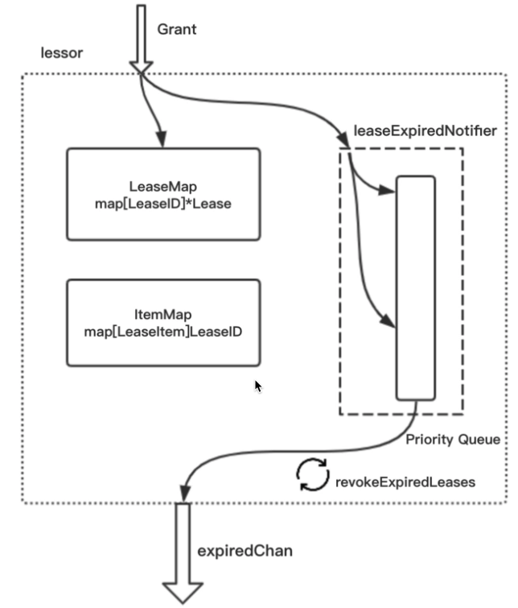

# 概述
租约，ETCD的重要特性，用于实现key定时删除功能。

# 使用租约
```go
func testLease() {
    le := newLessor()    // 创建一个lessor
    le.Promote(0)        // 将lessor设置为Primary，这个与raft会出现网络分区有关，不了解可以忽略
    
    go func() {          // 开启一个协程，接收过期的key，主动删除
        for {  
           expireLease := <-le.ExpiredLeasesC()  

           for _, v := range expireLease {  
              le.Revoke(v.ID)    // 通过租约ID删除租约，删除租约时会从backend中删除绑定的key
           }  
        }
    }()
    
    ttl = 5                      // 过期时间设置5s
    lease := le.Grant(id, ttl)   // 申请一个租约
    
    le.Attach(lease, "foo")      // 将租约绑定在"foo"上
    
    time.Sleep(10 * time.Second) // 阻塞10s，方便看到结果
}
```

# 架构图

* LeaseMap map[LeaseID]*Lease 用于根据LeaseID快速找到*Lease
* ItemMap map[LeaseItem]LeaseID 用于根据LeaseItem快速找到LeaseID，从而找到*Lease
* LeaseExpiredNotifier是对LeaseQueue的一层封装，他实现了快要到期的租约永远在队头。(堆实现)

# 实现
## Lessor
```go
// Lessor owns leases. It can grant, revoke, renew and modify leases for lessee.
type Lessor interface {
	// SetRangeDeleter lets the lessor create TxnDeletes to the store.
	// Lessor deletes the items in the revoked or expired lease by creating
	// new TxnDeletes.
	SetRangeDeleter(rd RangeDeleter)

	SetCheckpointer(cp Checkpointer)
	// 创建一个租约，在指定的ttl时间过期
	Grant(id LeaseID, ttl int64) (*Lease, error)
	// 撤销指定的 Lease，Lease实例相关的 LeaseItem 也会被删除
	Revoke(id LeaseID) error

	// Checkpoint applies the remainingTTL of a lease. The remainingTTL is used in Promote to set
	// the expiry of leases to less than the full TTL when possible.
	Checkpoint(id LeaseID, remainingTTL int64) error

    // 租约与 LeaseItem 实例绑定
	Attach(id LeaseID, items []LeaseItem) error

    // 根据 LeaseItem 返回租约id
	GetLease(item LeaseItem) LeaseID
    // 取消绑定关系
	Detach(id LeaseID, items []LeaseItem) error

	// 如果成为了 Lease 节点，需要使用该方法晋升，成为主 Lessor
	// 主 Lessor 控制这集群中所有 Lease 实例
	Promote(extend time.Duration)
    // Promote 的逆
	Demote()

    // 续约
	Renew(id LeaseID) (int64, error)

    // 根据饿 ID 查找 Lease
	Lookup(id LeaseID) *Lease

	// Leases lists all leases.
	Leases() []*Lease

    // 如果有 lease 实例过期，写入该通道
	ExpiredLeasesC() <-chan []*Lease

    // 从底层存储回复 Lease
	Recover(b backend.Backend, rd RangeDeleter)

	// Stop stops the lessor for managing leases. The behavior of calling Stop multiple
	// times is undefined.
	Stop()
}
```
本接口有两个实现
* FakeLessor  空实现
* lessor

## lessor 
```go
type lessor struct {
	mu sync.RWMutex

	// demotec is set when the lessor is the primary.
	// demotec will be closed if the lessor is demoted.
	demotec chan struct{}
    // 记录 id 到 Lease， Lease 结构下文会说明
	leaseMap             map[LeaseID]*Lease
	// LeaseQueue 的一层封装，最快到期的租约永远在对头
	leaseExpiredNotifier *LeaseExpiredNotifier
	leaseCheckpointHeap  LeaseQueue
	// LeaseItem -> Lease
	itemMap              map[LeaseItem]LeaseID

	// 主要作用时从底层存储中删除过期的 Lease 实例
	rd RangeDeleter

	// When a lease's deadline should be persisted to preserve the remaining TTL across leader
	// elections and restarts, the lessor will checkpoint the lease by the Checkpointer.
	cp Checkpointer

    // 用于持久化 Lease
	b backend.Backend

   // 过期时间的最小值
	minLeaseTTL int64

    // 过期时会把实例写入通道
	expiredC chan []*Lease

	// Wait duration between lease checkpoints.
	checkpointInterval time.Duration
	// the interval to check if the expired lease is revoked
	expiredLeaseRetryInterval time.Duration
}
```
* Lease
```go
type Lease struct {
	ID           LeaseID
	// 存活时长，秒
	ttl          int64 // time to live of the lease in seconds
	// 剩余存活事件 秒
	remainingTTL int64 // remaining time to live in seconds, if zero valued it is considered unset and the full ttl should be used
	// expiryMu protects concurrent accesses to expiry
	expiryMu sync.RWMutex
	// expiry is time when lease should expire. no expiration when expiry.IsZero() is true
	// 实例过期时的时间戳
	expiry time.Time

	// mu protects concurrent accesses to itemSet
	mu      sync.RWMutex
	// 该Lease 绑定的 LeaseItem，LeaseItem 里只有一个字段 Key（这个是原始key）
	itemSet map[LeaseItem]struct{}
	// Lease 实例销毁时，关闭该通道
	revokec chan struct{}
}
```

### lessor 初始化
```go
func newLessor(lg *zap.Logger, b backend.Backend, cfg LessorConfig) *lessor {
	checkpointInterval := cfg.CheckpointInterval
	expiredLeaseRetryInterval := cfg.ExpiredLeasesRetryInterval
	if checkpointInterval == 0 {
		checkpointInterval = defaultLeaseCheckpointInterval
	}
	if expiredLeaseRetryInterval == 0 {
		expiredLeaseRetryInterval = defaultExpiredleaseRetryInterval
	}
    // 创建 lessor 实例
	l := &lessor{
		leaseMap:                  make(map[LeaseID]*Lease),
		itemMap:                   make(map[LeaseItem]LeaseID),
		leaseExpiredNotifier:      newLeaseExpiredNotifier(),
		leaseCheckpointHeap:       make(LeaseQueue, 0),
		b:                         b,
		minLeaseTTL:               cfg.MinLeaseTTL,
		checkpointInterval:        checkpointInterval,
		expiredLeaseRetryInterval: expiredLeaseRetryInterval,
		// expiredC is a small buffered chan to avoid unnecessary blocking.
		expiredC: make(chan []*Lease, 16),
		stopC:    make(chan struct{}),
		doneC:    make(chan struct{}),
		lg:       lg,
	}
	// 进一步初始化
	l.initAndRecover()

    // 查找当前 lessor 是否有过期的lease
	go l.runLoop()

	return l
}
```
initAndRecover()
```go
func (le *lessor) initAndRecover() {
	// 开启读写事务
	tx := le.b.BatchTx()
	tx.Lock()
    // 创建lease的bucketname， 	leaseBucketName = []byte("lease")
	tx.UnsafeCreateBucket(leaseBucketName)
	// 查找该bucket中全部信息
	_, vs := tx.UnsafeRange(leaseBucketName, int64ToBytes(0), int64ToBytes(math.MaxInt64), 0)
	// TODO: copy vs and do decoding outside tx lock if lock contention becomes an issue.
	for i := range vs {
		var lpb leasepb.Lease
		// 反序列化的得到存储的leasepb.Lease, 与 Lease 不是一个，pb的这个记录的信息较少，只有 id 和 ttl
		err := lpb.Unmarshal(vs[i])
		ID := LeaseID(lpb.ID)
		// 修正过期时间，如果小于最小的租约ttl，就更新成最小的
		if lpb.TTL < le.minLeaseTTL {
			lpb.TTL = le.minLeaseTTL
		}
        // 创建 Lease 实例并放入 leaseMap
		le.leaseMap[ID] = &Lease{
			ID:  ID,
			ttl: lpb.TTL,
			// itemSet will be filled in when recover key-value pairs
			// set expiry to forever, refresh when promoted
			itemSet: make(map[LeaseItem]struct{}),
			expiry:  forever,
			revokec: make(chan struct{}),
		}
	}
    // 初始化leaseExpiredNotifier  优先队列等等
	le.leaseExpiredNotifier.Init()
	heap.Init(&le.leaseCheckpointHeap)
	tx.Unlock()
    // 提交事务
	le.b.ForceCommit()
}
```
上边建立的协程 runLoop()
```go
func (le *lessor) runLoop() {
	defer close(le.doneC)
    // 一直循环处理
	for {
		// 下文描述，
		le.revokeExpiredLeases()
		le.checkpointScheduledLeases()

        // 阻塞 500ms，进行下一步检测
		select {
		case <-time.After(500 * time.Millisecond):
		case <-le.stopC:
			return
		}
	}
}
```
revokeExpiredLeases()
```go
从优先队列头依次查找是否有过期，有的话放入通道
func (le *lessor) revokeExpiredLeases() {
	var ls []*Lease

	// rate limit
	revokeLimit := leaseRevokeRate / 2

	le.mu.RLock()
	if le.isPrimary() {
		// 查找当前的过期租约
		ls = le.findExpiredLeases(revokeLimit)
	}
	le.mu.RUnlock()

	if len(ls) != 0 {
		select {
		case <-le.stopC:
			return
        // 过期租约写入通道
		case le.expiredC <- ls:
		default:
		    // 如果通道阻塞，则下次处理
		}
	}
}
```
### Grant()
创建租约，指定ttl
```go
func (le *lessor) Grant(id LeaseID, ttl int64) (*Lease, error) {
	// 创建租约实例
	l := &Lease{
		ID:      id,
		ttl:     ttl,
		itemSet: make(map[LeaseItem]struct{}),
		revokec: make(chan struct{}),
	}

	le.mu.Lock()
	defer le.mu.Unlock()
    // 如果已经存在直接返回错误 
	if _, ok := le.leaseMap[id]; ok {
		return nil, ErrLeaseExists
	}
    // 修正 ttl
	if l.ttl < le.minLeaseTTL {
		l.ttl = le.minLeaseTTL
	}

	if le.isPrimary() {
		// leader 更新实例的过期时间, 这里会把过期时间(expiry)改成当前时间加上ttl
		l.refresh(0)
	} else {
        // 不是leader永远不过期
		l.forever()
	}
    // 放入 leaseMap
	le.leaseMap[id] = l
	// 持久化成 leasepb.Lease
	l.persistTo(le.b)
	if le.isPrimary() {
		// 这里会把优先队列的用于比较查找的过期时间变成unix时间戳
		// 注意如果节点重启，可能会等待一段时间才会查到过期，因为要恢复数据
		item := &LeaseWithTime{id: l.ID, time: l.expiry.UnixNano()}
		le.leaseExpiredNotifier.RegisterOrUpdate(item)
		le.scheduleCheckpointIfNeeded(l)
    }

	return l, nil
}
```
### Revoke()
撤销指定id 的租约实例，关闭Lease的revokec通道，从leaseMap删除，还会删除Lease实例关联的键值对
```go
func (le *lessor) Revoke(id LeaseID) error {
	le.mu.Lock()

	l := le.leaseMap[id]

	txn := le.rd()

    // 获取实例绑定的 key 值
	keys := l.Keys()
	sort.StringSlice(keys).Sort()
	for _, key := range keys {
		// 依次删除绑定的键值对
		txn.DeleteRange([]byte(key), nil)
	}
	le.mu.Lock()
	defer le.mu.Unlock()
	// 从 leaseMap删除
	delete(le.leaseMap, l.ID)
	// 从底层存储 删除 Lease 信息
	le.b.BatchTx().UnsafeDelete(leaseBucketName, int64ToBytes(int64(l.ID)))

    // 提交事务
	txn.End()

	leaseRevoked.Inc()
	return nil
}
```

### Lease 存储

将Lease ID存放在名为“lease”的Bucket中，注意在这里只存放Lease相关的数据，其键值为：<Lease ID，序列化后的Lease数据包括TTL、ID>，之所以不存放与Lease绑定的键值，是因为这些键值已经存放到另外的Bucket里了，写入数据的时候也会将这些键值绑定的Lease ID写入，这样在恢复数据的时候就可以将键值与Lease ID绑定的关系写入内存中。

### 参考
* https://segmentfault.com/a/1190000021787065
* https://www.codedump.info/post/20181125-etcd-server/