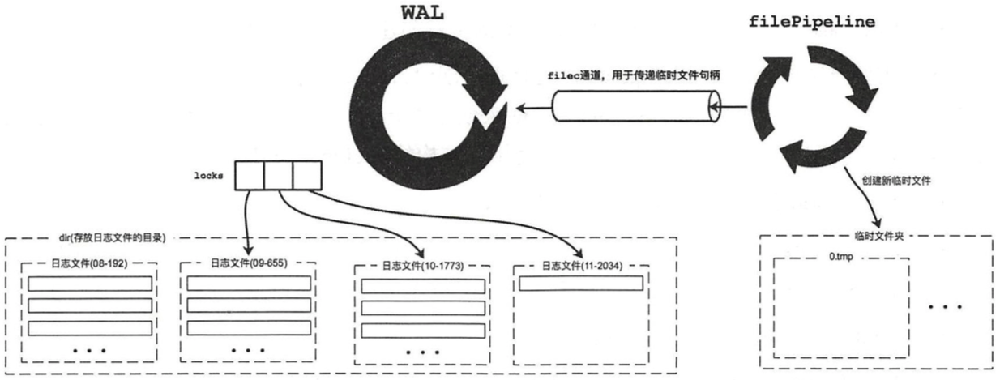

## 用于日志记录的 Record 结构（pb生成的）
```go
type Record struct {
    // 类型
    Type             int64  `protobuf:"varint,1,opt,name=type" json:"type"`
    // 校验码
    Crc              uint32 `protobuf:"varint,2,opt,name=crc" json:"crc"`
    // 日志数据，根据类型不同，内容也不同
	Data             []byte `protobuf:"bytes,3,opt,name=data" json:"data,omitempty"`
	XXX_unrecognized []byte `json:"-"`
}
```
类型
```go
const (
    // 元数据类型。每个wal文件的开头都记录了一条元数据
    metadataType int64 = iota + 1
    // entry 记录，客户端发送给服务端的数据， raftexample 里就是键值数据
    entryType
    // 集群状态， hardstate, 批量写入entrytype类型的日志之前，都会先记录一条 statetype日志
    stateType
    // 用于校验
    crcType
    // 快照的数据相关信息
    /*
    type Snapshot struct {
	Index            uint64 `protobuf:"varint,1,opt,name=index" json:"index"`
	Term             uint64 `protobuf:"varint,2,opt,name=term" json:"term"`
	XXX_unrecognized []byte `json:"-"`
     }
    */
	snapshotType

	// warnSyncDuration is the amount of time allotted to an fsync before
	// logging a warning
	warnSyncDuration = time.Second
)
```

## WAL 数据结构
```go
type WAL struct {

    // 目录
	dir string // the living directory of the underlay files

    // dirFile is a fd for the wal directory for syncing on Rename
    // File 实例
	dirFile *os.File
    
    // wal 头部的的元数据信息
	metadata []byte           // metadata recorded at the head of each WAL
	state    raftpb.HardState // hardstate recorded at the head of WAL
    // 读取wal 的开始位置，从snapshot的最后的index获取
    start     walpb.Snapshot // snapshot to start reading
    // 反序列化日志称Record
	decoder   *decoder       // decoder to decode records
	readClose func() error   // closer for decode reader

	unsafeNoSync bool // if set, do not fsync

	mu      sync.Mutex
    enti    uint64   // index of the last entry saved to the wal
    // 序列化 Record 实例
	encoder *encoder // encoder to encode records

    // 管理所有的wal日志文件句柄
    locks []*fileutil.LockedFile // the locked files the WAL holds (the name is increasing)
    // 负责创建一个临时文件, 文件Pipeline的思想就是采用“饿汉式”，即提前创建一些文件备用，这样可以加快文件的创建速度
	fp    *filePipeline
}
```
!

### 初始化
 1. 创建临时目录，并在临时目录中创建编号为“0-0”的WAL日志文件， WAL日志文件名由两部分组成，一部分是seq（单调递增），另一部分是该日志文件中的第一条日志记录的索引值。
 2. 尝试为该WAL日志文件预分配磁盘空间。
 3. 向该WAL日志文件中写入一条crcType类型的日志记录、一条metadataType类型的日志记录及一条snapshotType类型的日志记录。
 4. 创建WAL实例关联的filePipeline实例。
 5. 将临时目录重命名为WAL.dir字段指定的名称。

```go
func Create(lg *zap.Logger, dirpath string, metadata []byte) (*WAL, error) {
	if Exist(dirpath) {
		return nil, os.ErrExist
	}

    // keep temporary wal directory so WAL initialization appears atomic
    // 先在.tmp临时文件上做修改，修改完之后可以直接执行rename,这样起到了原子修改文件的效果
    // 先清理
	tmpdirpath := filepath.Clean(dirpath) + ".tmp"
	if fileutil.Exist(tmpdirpath) {
		if err := os.RemoveAll(tmpdirpath); err != nil {
			return nil, err
		}
	}
	if err := fileutil.CreateDirAll(tmpdirpath); err != nil {
		if lg != nil {
			lg.Warn(
				"failed to create a temporary WAL directory",
				zap.String("tmp-dir-path", tmpdirpath),
				zap.String("dir-path", dirpath),
				zap.Error(err),
			)
		}
		return nil, err
	}

    // dir/filename  ,filename从walName获取   seq-index.wal， 第一个是 0-0
	p := filepath.Join(tmpdirpath, walName(0, 0))
	f, err := fileutil.LockFile(p, os.O_WRONLY|os.O_CREATE, fileutil.PrivateFileMode)
	if err != nil {
		if lg != nil {
			lg.Warn(
				"failed to flock an initial WAL file",
				zap.String("path", p),
				zap.Error(err),
			)
		}
		return nil, err
    }
    // 定位到文件末尾
	if _, err = f.Seek(0, io.SeekEnd); err != nil {
		if lg != nil {
			lg.Warn(
				"failed to seek an initial WAL file",
				zap.String("path", p),
				zap.Error(err),
			)
		}
		return nil, err
    }
    // 预分配空间
	if err = fileutil.Preallocate(f.File, SegmentSizeBytes, true); err != nil {
		if lg != nil {
			lg.Warn(
				"failed to preallocate an initial WAL file",
				zap.String("path", p),
				zap.Int64("segment-bytes", SegmentSizeBytes),
				zap.Error(err),
			)
		}
		return nil, err
	}
   
    // WAl 实例
	w := &WAL{
		lg:       lg,
		dir:      dirpath,
		metadata: metadata,
    }
    // 在这个wal文件上创建一个encoder
	w.encoder, err = newFileEncoder(f.File, 0)
	if err != nil {
		return nil, err
    }
    // 把这个上了互斥锁的文件加入到locks数组中
	w.locks = append(w.locks, f)
	if err = w.saveCrc(0); err != nil {
		return nil, err
    }
    // 将metadataType类型的record记录在wal的header处
	if err = w.encoder.encode(&walpb.Record{Type: metadataType, Data: metadata}); err != nil {
		return nil, err
    }
    // 保存空的snapshot
	if err = w.SaveSnapshot(walpb.Snapshot{}); err != nil {
		return nil, err
	}

    // 重命名，之前以.tmp结尾的文件，初始化完成之后重命名，类似原子操作  
	if w, err = w.renameWAL(tmpdirpath); err != nil {
		if lg != nil {
			lg.Warn(
				"failed to rename the temporary WAL directory",
				zap.String("tmp-dir-path", tmpdirpath),
				zap.String("dir-path", w.dir),
				zap.Error(err),
			)
		}
		return nil, err
	}

	var perr error
	defer func() {
		if perr != nil {
			w.cleanupWAL(lg)
		}
	}()

    // directory was renamed; sync parent dir to persist rename
    // 将上述的所有文件操作刷新到磁盘上
	pdir, perr := fileutil.OpenDir(filepath.Dir(w.dir))
	if perr != nil {
		if lg != nil {
			lg.Warn(
				"failed to open the parent data directory",
				zap.String("parent-dir-path", filepath.Dir(w.dir)),
				zap.String("dir-path", w.dir),
				zap.Error(perr),
			)
		}
		return nil, perr
	}
	start := time.Now()
	if perr = fileutil.Fsync(pdir); perr != nil {
		if lg != nil {
			lg.Warn(
				"failed to fsync the parent data directory file",
				zap.String("parent-dir-path", filepath.Dir(w.dir)),
				zap.String("dir-path", w.dir),
				zap.Error(perr),
			)
		}
		return nil, perr
	}
	walFsyncSec.Observe(time.Since(start).Seconds())

	if perr = pdir.Close(); perr != nil {
		if lg != nil {
			lg.Warn(
				"failed to close the parent data directory file",
				zap.String("parent-dir-path", filepath.Dir(w.dir)),
				zap.String("dir-path", w.dir),
				zap.Error(perr),
			)
		}
		return nil, perr
	}

	return w, nil
}
```
WAL日志文件遵循一定的命名规则，由walName实现，格式为"序号--raft日志索引.wal"。
```go
// 根据seq和index产生wal文件名
func walName(seq, index uint64) string {
	return fmt.Sprintf("%016x-%016x.wal", seq, index)
}
```
record 序列化方法
```go
func (e *encoder) encode(rec *walpb.Record) error {
	e.mu.Lock()
	defer e.mu.Unlock()

    // 生成数据的crc
	e.crc.Write(rec.Data)
	rec.Crc = e.crc.Sum32()
	var (
		data []byte
		err  error
		n    int
	)

	if rec.Size() > len(e.buf) {
        // 如果超过预分配的buf，就使用动态分配
		data, err = rec.Marshal()
		if err != nil {
			return err
		}
	} else {
		n, err = rec.MarshalTo(e.buf)
		if err != nil {
			return err
		}
		data = e.buf[:n]
	}

    lenField, padBytes := encodeFrameSize(len(data))
    // 先写recode编码后的长度
	if err = writeUint64(e.bw, lenField, e.uint64buf); err != nil {
		return err
	}

	if padBytes != 0 {
        // 如果有追加数据（对齐需求）
		data = append(data, make([]byte, padBytes)...)
    }
    // 写recode内容
	n, err = e.bw.Write(data)
	walWriteBytes.Add(float64(n))
	return err
}
```
 从代码可以看到，一个Record被序列化之后（这里为JOSN格式），会以一个Frame的格式持久化。Frame首先是一个长度字段（encodeFrameSize完成,在encoder.go文件），64bit，其中MSB表示这个Frame是否有padding字节，接下来才是真正的序列化后的数据。
```go
func encodeFrameSize(dataBytes int) (lenField uint64, padBytes int) {
	lenField = uint64(dataBytes)
	// force 8 byte alignment so length never gets a torn write
	padBytes = (8 - (dataBytes % 8)) % 8
	if padBytes != 0 {
		// lenField的高56记录padding的长度
		lenField |= uint64(0x80|padBytes) << 56 // 最高位为1用于表示含有padding，方便在decode的时候判断
	}
	return lenField, padBytes
}
```
!

### 读取日志
* ReadALL()
```go
func (w *WAL) ReadAll() (metadata []byte, state raftpb.HardState, ents []raftpb.Entry, err error) {
	w.mu.Lock()
	defer w.mu.Unlock()

    // 创建 Record 实例
	rec := &walpb.Record{}

	if w.decoder == nil {
		return nil, state, nil, ErrDecoderNotFound
    }
    // 解码器，反序列化日志称 Record
	decoder := w.decoder

    var match bool
    // 循环读取日志文件
	for err = decoder.decode(rec); err == nil; err = decoder.decode(rec) {
		switch rec.Type {
            // 根据recode的type进行不同处理
        case entryType:
            // 反序列化 data 字段
			e := mustUnmarshalEntry(rec.Data)
            // 0 <= e.Index-w.start.Index - 1 < len(ents)
            // start 之后 entry 添加到 ents
			if e.Index > w.start.Index {
				// prevent "panic: runtime error: slice bounds out of range [:13038096702221461992] with capacity 0"
				up := e.Index - w.start.Index - 1
				if up > uint64(len(ents)) {
					// return error before append call causes runtime panic
					return nil, state, nil, ErrSliceOutOfRange
				}
				ents = append(ents[:up], e)
            }
            // 记录最后一条的索引
			w.enti = e.Index

		case stateType:

		case metadataType:

		case crcType:

		case snapshotType:
			
		default:
			state.Reset()
			return nil, state, nil, fmt.Errorf("unexpected block type %d", rec.Type)
		}
	}

    // 读写模式
	switch w.tail() {
	}

	err = nil
	if !match {
		err = ErrSnapshotNotFound
	}

	// close decoder, disable reading
	if w.readClose != nil {
		w.readClose()
		w.readClose = nil
	}
	w.start = walpb.Snapshot{}

	w.metadata = metadata

	if w.tail() != nil {
        // create encoder (chain crc with the decoder), enable appending
        // 初始化 encoder
		w.encoder, err = newFileEncoder(w.tail().File, w.decoder.lastCRC())
		if err != nil {
			return
		}
	}
	w.decoder = nil

	return metadata, state, ents, err
}
```

### 追加日志
```go
func (w *WAL) Save(st raftpb.HardState, ents []raftpb.Entry) error {
	w.mu.Lock()
	defer w.mu.Unlock()

	// short cut, do not call sync
	if raft.IsEmptyHardState(st) && len(ents) == 0 {
		return nil
	}

	mustSync := raft.MustSync(st, w.state, len(ents))

    // TODO(xiangli): no more reference operator
    // 序列化，并写入日志文件
	for i := range ents {
		if err := w.saveEntry(&ents[i]); err != nil {
			return err
		}
    }
    // 添加状态信息
	if err := w.saveState(&st); err != nil {
		return err
	}
    // 获取文件尾部
	curOff, err := w.tail().Seek(0, io.SeekCurrent)
	if err != nil {
		return err
	}
	if curOff < SegmentSizeBytes {
        // 刷新磁盘
		if mustSync {
			return w.sync()
		}
		return nil
	}

	return w.cut()
}
```
### 文件切换
随着WAL日志文件的不断写入， 单个日志文件会不断变大。在前面提到过，每个日志文件的大小是有上限的，该阀值由SegmentSizeBytes指定（默认值是64MB）， 该值也是日志文件预分配磁盘空间的大小。当单个日志文件的大小超过该值时， 就会触发日志文件的切换，该切换过程是在WAL.cut（）方法中实现的。WAL.cut（）方法首先通过filePipeline 获取一个新建的临时文件，然后写入crcType类型、metaType类型、stateType类型等必要日志记录（这个步骤与前面介绍的Create（）方法类似），然后将临时文件重命名成符合WAL日志命名规范的新日志文件，并创建对应的encoder实例更新到WAL.encoder字段。