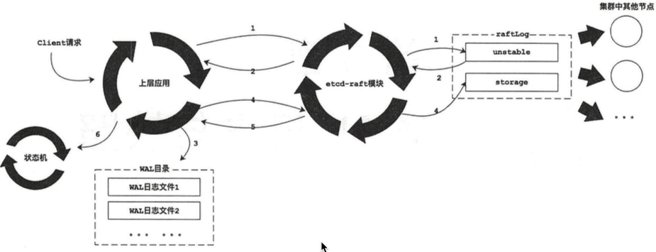

# wal 
WAL是write ahead log的缩写，顾名思义，也就是在执行真正的写操作之前先写一个日志，可以类比redo log，这些日志都会严格保证持久化，以保证整个操作的一致性和可恢复性。

## 文件目录
!

## 处理一条 enty 的粗略流程
1. 当客户端向etcd 集群发送了一次请求之后，请求中的封装Entry记录会先被交给raft模块进行处理，raft模块会先将Entry记录保存到raftLog.unstable中。
2. raft模块将该Entry记录封装到前面介绍的Ready实例中，返回给上层模块进行持久化。
3. 当上层模块收到待持久化的Entry记录之后，会先将其记录到WAL日志文件中，然后进行持久化操作，最后通知raft模块进行处理。
4. 此时就会将该 Entry 记录从 unstable 移动到 storage 中保存。
5. 待该Entry记录被复制到集群中的半数以上节点时，该Entry记录会被Leader节点确认为己提交（committed），并封装进Ready实例返回给上层模块。
6. 上层模块即可将该Ready实例中携带的待应用Entry记录应用到状态机中。
!

## wal 日志两种模式
* append 追加日志
* read  只读

# snap
* 在raft协议中，snapshot主要用来压缩raft日志、减少raft日志的数量，一旦正确产生并持久化了一个snapshot，那么在这个snapshot之前的日志全部都可以直接丢掉。

* 一般情况下，集群中的每个节点都会自己独立、定时地创建快照，在其状态恢复时，都会使用自己本地最新的快照数据。如果Follower节点长时间宕机（或是刚刚加入集群的新节点），就有可能导致其日志记录远远落后于当前的Leader节点，与此同时，Leader节点中陈旧的日志记录己被删除了。 在这种场景下，为了将该Follower节点恢复到正确的状态，Leader节点会将快照发送给该Follower节点，Follower节点会使用该快照数据进行状态恢复。

## 文件目录
! 
