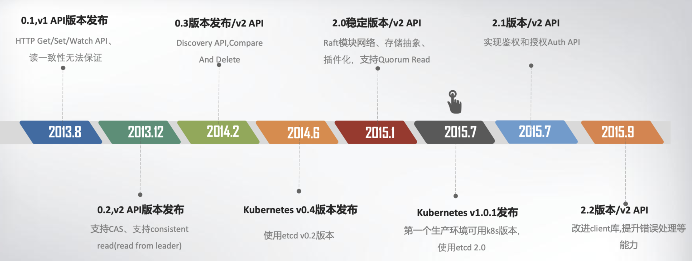
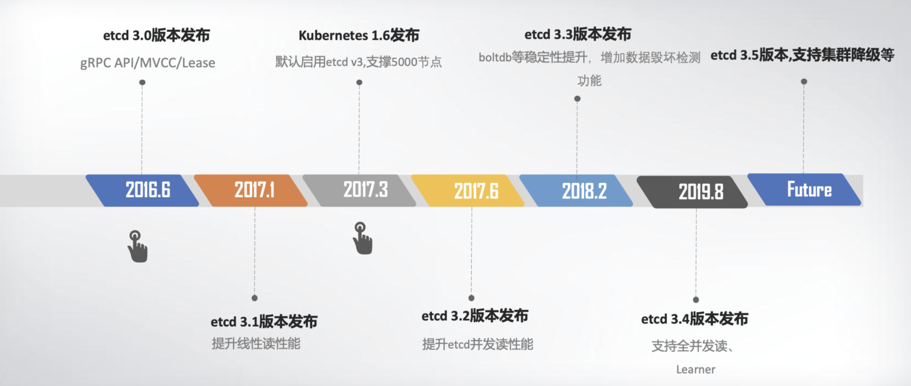
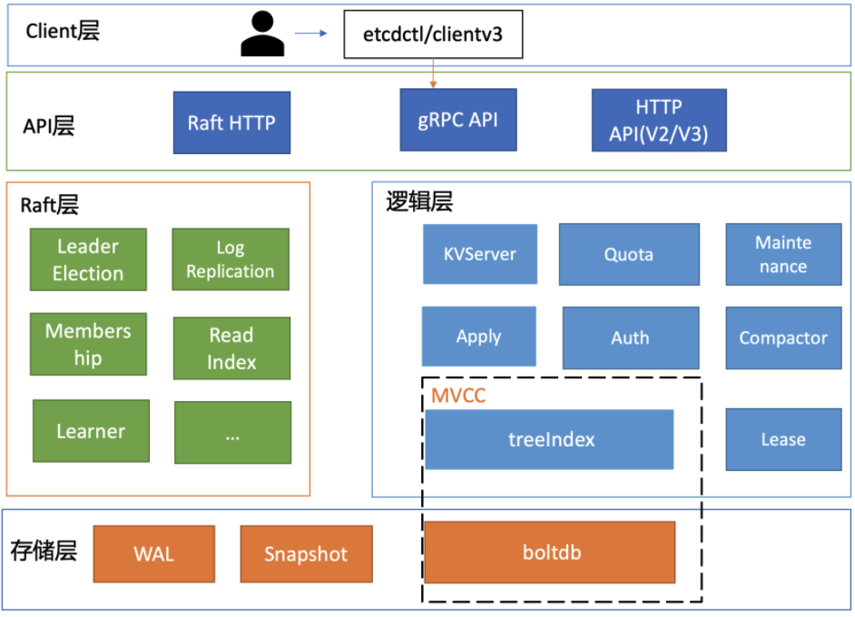
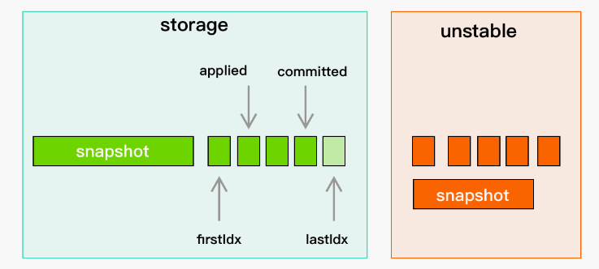
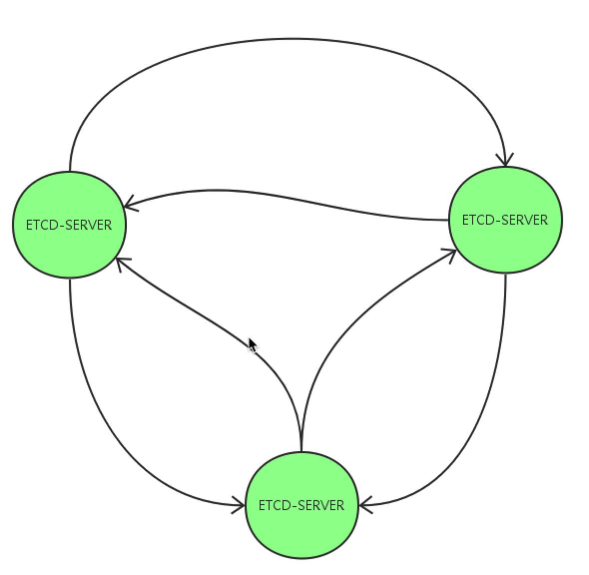
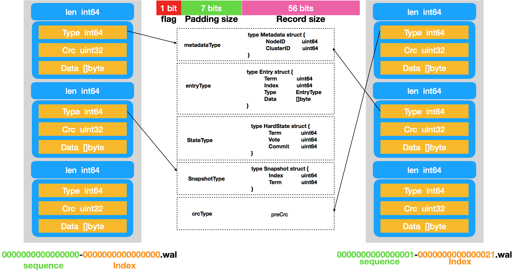
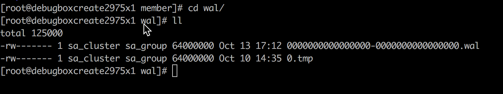
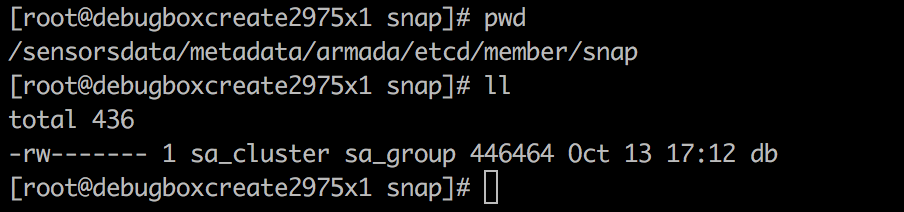
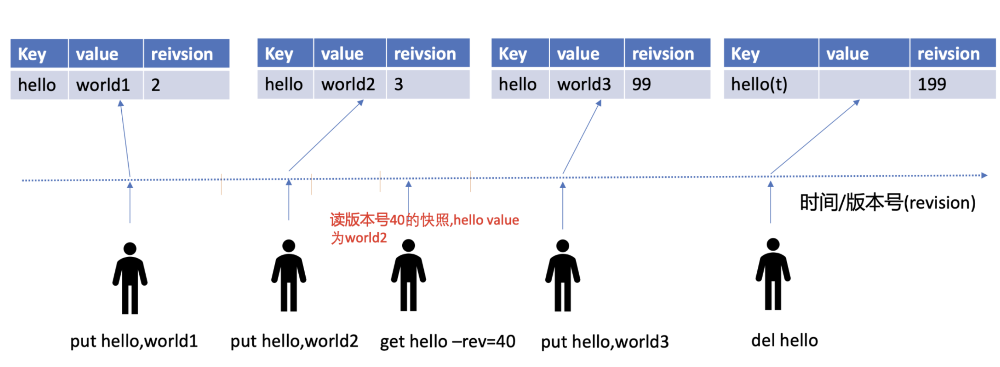

[TOC]

# 1 etcd 综述
## 1.1 etcd 是什么
官网定义： 
1. Highly-avaliable key value store for shared configuration and service discovery
2. A distributed, reliable key-value store for the most critical data of a distributed system
* [性能测试](https://github.com/etcd-io/etcd/blob/master/Documentation/op-guide/performance.md#benchmarks)

### 1.1.1 etcd v2 发布时间轴


### 1.1.2 etcd v3 发布时间轴


## 1.2 Adopters


## 1.3 etcd VS zookeeper
### 1.3.1 主要解决的问题：
* 元数据存储
* 分布式协同

### 1.3.2 etcd 的优点
* 支持线性读（支持读到最新数据）
* **流式 Watcher**，历史事件**通常**不会丢失，复用网络连接；zookeeper 是单次 watch，服务端接受到 watch 请求之前的事件丢失，每个 watch 请求使用新的连接
* 通讯协议：
    * zk 基于自定义的 Jute 协议， 其他语言的支持困难
	* etcd 基于 gRPC，其他语言开箱即用
* 分布式协同原语维护方（分布式锁，选举，租约等）
    * etcd 是 官方维护
	* zk 通常使用 Curator。Curator是 Netflix 公司开源的一个Zookeeper客户端，Curator框架在zookeeper 原生 API 接口上进行了包装，解决了很多 ZooKeeper 客户端非常底层的细节开发

## 1.4 版本控制 (MVCC)
* 写操作都会创建新的版本
* 读操作会从有限的多个版本中挑选一个最合适的（要么是最新版本，要么是指定版本)
* 无需关心读写之间的冲突

### 1.4.1 版本描述
从 etcd 中描述 key value 可以看到：
```go
type KeyValue struct {
	// key is the key in bytes. An empty key is not allowed.
	Key []byte `protobuf:"bytes,1,opt,name=key,proto3" json:"key,omitempty"`
	// 该 key 最后一次时的 revision, （分布式锁就用了它）
	CreateRevision int64 `protobuf:"varint,2,opt,name=create_revision,json=createRevision,proto3" json:"create_revision,omitempty"`
	// 该 key 最后一次修改时的 revision
	ModRevision int64 `protobuf:"varint,3,opt,name=mod_revision,json=modRevision,proto3" json:"mod_revision,omitempty"`
	// 1. key 当前的版本
	// 2. 任何对 key 的修改都会增加该值
	// 3. 删除 key 会使该值归零
	Version int64 `protobuf:"varint,4,opt,name=version,proto3" json:"version,omitempty"`
	// value is the value held by the key, in bytes.
	Value []byte `protobuf:"bytes,5,opt,name=value,proto3" json:"value,omitempty"`
	// 赋予的租约id，如果是 0 代表没有租约
	Lease int64 `protobuf:"varint,6,opt,name=lease,proto3" json:"lease,omitempty"`
}
```

### 1.4.2 逻辑时钟 (revision)
* int64 全局递增
* 可以视为全局的逻辑时钟，任何键空间发生变化，revision 都会增加；指定 revision 操作时，理解为时钟回退到那个时刻
* 用事务封装的操作，revision 在后台只会更改一次
* revision值大的键值对一定是在revision值小键值对之后修改的

## 1.5 etcd API
* https://github.com/etcd-io/etcd/blob/release-3.4/etcdserver/etcdserverpb/rpc.proto
* https://godoc.org/github.com/coreos/etcd/clientv3

### 1.5.1 核心 API
#### 1.5.1.1 KV
(range, 线性读/串行读)
```go
service KV {
  // 从键值存储中获取范围内的key.
  rpc Range(RangeRequest) returns (RangeResponse) {}
​
  // 放置给定key到键值存储.
  rpc Put(PutRequest) returns (PutResponse) {}
​
  // 从键值存储中删除给定范围。
  rpc DeleteRange(DeleteRangeRequest) returns (DeleteRangeResponse) {}
​
  // 在单个事务中处理多个请求。
  // 不容许在一个txn中多次修改同一个key.
  rpc Txn(TxnRequest) returns (TxnResponse) {}
​
  // 压缩在etcd键值存储中的事件历史。
  // 键值存储应该定期压缩，否则事件历史会无限制的持续增长.
  rpc Compact(CompactionRequest) returns (CompactionResponse) {}
}
```

#### 1.5.1.2 Watch
(复用连接、watch 范围/历史)
```go
service Watch {
  // Watch watches for events happening or that have happened. Both input and output
  // are streams; the input stream is for creating and canceling watchers and the output
  // stream sends events. One watch RPC can watch on multiple key ranges, streaming events
  // for several watches at once. The entire event history can be watched starting from the
  // last compaction revision.
  // 1. Watch 检测将要发生或者已经发生的事件。
  // 2. 输入流用于创建和取消观察，输出流发送事件。
  // 3. 一个 RPC 可以在多个 key range 上 watch。
  // 4. watch 可以在最后压缩修订版本开始观察。
  rpc Watch(stream WatchRequest) returns (stream WatchResponse) {}}
}
```

#### 1.5.1.3 Lease
(有最小TTL/集群时钟不一致时ttl不准)
```go
service Lease {
  // LeaseGrant 创建一个租约，当服务器在给定 time to live 时间内没有接收到 keepAlive 时租约过期。
  // 如果租约过期则所有附加在租约上的key将过期并被删除。
  // 每个过期的key在事件历史中生成一个删除事件。
  rpc LeaseGrant(LeaseGrantRequest) returns (LeaseGrantResponse) {}

  // LeaseRevoke 撤销一个租约。
  // 所有附加到租约的key将过期并被删除。
  rpc LeaseRevoke(LeaseRevokeRequest) returns (LeaseRevokeResponse) {}

  // 续约
  rpc LeaseKeepAlive(stream LeaseKeepAliveRequest) returns (stream LeaseKeepAliveResponse) {}

  // LeaseTimeToLive 获取租约信息。
  rpc LeaseTimeToLive(LeaseTimeToLiveRequest) returns (LeaseTimeToLiveResponse) {}
}
```

clientV3：
* KeepAlive 自动无限续租
    * grpc stream，创建协程无限续租，间隔500ms
    * 如果 stream 失效， 500ms重试
* KeepAliveOnce 续租一次

#### 1.5.1.4 Cluster
集群管理相关 add/remove/update member/learner


#### 1.5.1.5 Maintenance
维护相关操作(报警/后端碎片整理)

#### 1.5.1.6 Auth
用户鉴权管理相关

### 1.5.2 并发 API
[并发 API 官方文档](https://github.com/etcd-io/etcd/blob/master/Documentation/dev-guide/api_concurrency_reference_v3.md)
#### 1.5.2.1 Lock 分布式锁
```go
type LockServer interface {
	// Lock acquires a distributed shared lock on a given named lock.
	// On success, it will return a unique key that exists so long as the
	// lock is held by the caller. This key can be used in conjunction with
	// transactions to safely ensure updates to etcd only occur while holding
	// lock ownership. The lock is held until Unlock is called on the key or the
	// lease associate with the owner expires.
	Lock(context.Context, *LockRequest) (*LockResponse, error)
	// Unlock takes a key returned by Lock and releases the hold on lock. The
	// next Lock caller waiting for the lock will then be woken up and given
	// ownership of the lock.
	Unlock(context.Context, *UnlockRequest) (*UnlockResponse, error)
}
```
etcdserver/api/v3lock/lock.go 通过 clientV3(concurrency) 实现

* 在 key prefix 下创建一个key，并不断续租
* key prefix下的所有 key 有不同的revision，revision 最小的那个 key 将获得锁
* revision 不是最小的 key 的持有者将阻塞，直到revision比它小的所有key都被删除时，它才获得锁

核心逻辑：
* lock
```go
func (m *Mutex) Lock(ctx context.Context) error {
	s := m.s
	client := m.s.Client()
    //尝试抢锁客户端要创建的key的名字
    m.myKey = fmt.Sprintf("%s%x", m.pfx, s.Lease())
    // 事务，key不存在则创建，存在则get（重复使用已经持有的锁key）,并且都获取 prefix key的信息
	cmp := v3.Compare(v3.CreateRevision(m.myKey), "=", 0)
	put := v3.OpPut(m.myKey, "", v3.WithLease(s.Lease()))
	get := v3.OpGet(m.myKey)
    getOwner := v3.OpGet(m.pfx, v3.WithFirstCreate()...)
    // 启动事务 
    resp, err := client.Txn(ctx).If(cmp).Then(put, getOwner).Else(get, getOwner).Commit()
    // 拿到当前的 revision，用于比较自己是否是最小的, 如果是最小的则抢锁成功
	m.myRev = resp.Header.Revision
	// if no key on prefix / the minimum rev is key, already hold the lock
	ownerKey := resp.Responses[1].GetResponseRange().Kvs
	if len(ownerKey) == 0 || ownerKey[0].CreateRevision == m.myRev {
		m.hdr = resp.Header
		return nil
	}
    // 如果没抢到就等待比自己小的key都删除
	hdr, werr := waitDeletes(ctx, client, m.pfx, m.myRev-1)
	return werr
}
```
问题： 如果 keyprefix下的 key 被外部删除了，所有都认为自己抢锁成功
* unlock: 把 myKey 删掉就行了


#### 1.5.2.2 Election 选举
```go
type ElectionServer interface {
	// Campaign waits to acquire leadership in an election, returning a LeaderKey
	// representing the leadership if successful. The LeaderKey can then be used
	// to issue new values on the election, transactionally guard API requests on
	// leadership still being held, and resign from the election.
	Campaign(context.Context, *CampaignRequest) (*CampaignResponse, error)
	// Proclaim updates the leader's posted value with a new value.
	Proclaim(context.Context, *ProclaimRequest) (*ProclaimResponse, error)
	// Leader returns the current election proclamation, if any.
	Leader(context.Context, *LeaderRequest) (*LeaderResponse, error)
	// Observe streams election proclamations in-order as made by the election's
	// elected leaders.
	Observe(*LeaderRequest, Election_ObserveServer) error
	// Resign releases election leadership so other campaigners may acquire
	// leadership on the election.
	Resign(context.Context, *ResignRequest) (*ResignResponse, error)
}
```
etcdserver/api/v3election/election.go 通过 clientV3(concurrency) 

选举

1. etcd的选举也是在相应的prefix path下面创建key，该key绑定了lease 并根据 lease id进行命名
2. key创建后就有revision号，这样使得在prefix path下的key也都是按revision有序
3. 每个节点watch比自己createRevision小并且最大的节点，等到所有比自己createRevision小的节点都被删除后，自己才成为leader
```go
func (e *Election) Campaign(ctx context.Context, val string) error {
	s := e.session
	client := e.session.Client()
	// 事务，如果if判断为true，那么put这个key，否则get这个key；最终都能获取到这个key的内容。
	k := fmt.Sprintf("%s%x", e.keyPrefix, s.Lease())
	txn := client.Txn(ctx).If(v3.Compare(v3.CreateRevision(k), "=", 0))
	txn = txn.Then(v3.OpPut(k, val, v3.WithLease(s.Lease())))
	txn = txn.Else(v3.OpGet(k))
	resp, err := txn.Commit()

	e.leaderKey, e.leaderRev, e.leaderSession = k, resp.Header.Revision, s
	// key 已经存在，执行的事务的 else 分支
	if !resp.Succeeded {
		kv := resp.Responses[0].GetResponseRange().Kvs[0]
		e.leaderRev = kv.CreateRevision
		if string(kv.Value) != val {
			// 判定val不相同，在不更换leader的情况下，更新val
			if err = e.Proclaim(ctx, val); err != nil {
				e.Resign(ctx)
				return err
			}
		}
	}

    // 一直阻塞知道当前的revision最小,从而当选 leader
	_, err = waitDeletes(ctx, client, e.keyPrefix, e.leaderRev-1)
	return nil
}
```

重新选举
```go
func (e *Election) Resign(ctx context.Context) (err error) {
	if e.leaderSession == nil {
		return nil
	}
	client := e.session.Client()
	// 如果当前leaderkey的revision没有变化，就把节点删除，
	cmp := v3.Compare(v3.CreateRevision(e.leaderKey), "=", e.leaderRev)
	resp, err := client.Txn(ctx).If(cmp).Then(v3.OpDelete(e.leaderKey)).Commit()
	e.leaderKey = ""
	e.leaderSession = nil
	return err
}
```

## 1.6 etcd 主要应用场景

* 服务发现 (租约，心跳保持 )
* 消息发布与订阅 (Watch)
* 负载均衡 (利用服务发现维护可用服务列表，请求过来后轮询转发)
* 分布式通知与协调 (Watch)
* 分布式锁 (最小的 create_revision)
* 选举（分布式锁）

## 1.7 高可用
半数以上投票可选主（单节点特殊选主流程，直接为主）
| 节点个数 | 高可用情况                                                                    |
| -------- | ---------------------------------------------------------------------------------- |
| 1        | 没有高可用，可以选主                                                     |
| 2        | 没有高可用，能选主，如果挂掉一台，不能选主，活着的节点可以读（非一致性读），不能写 |
| 3        | 允许挂1个                                                                      |
| 4        | 允许挂1个                                                                      |
| 5        | 允许挂2个                                                                      |
| 6        | 允许挂2个                                                                      ||

## 1.8 Demo
https://etcd.io/docs/v3.4.0/demo/
* get/put
* compact
* txn
* watch
* lease
* status

```shell
[DEV (v.v) sa_cluster@test1 ~]$ /sensorsdata/main/program/armada/etcd/bin/etcdctl endpoint status -w="table"  --endpoints=test1.sa:2379
+---------------+------------------+---------+---------+-----------+------------+-----------+------------+--------------------+--------+
|   ENDPOINT    |        ID        | VERSION | DB SIZE | IS LEADER | IS LEARNER | RAFT TERM | RAFT INDEX | RAFT APPLIED INDEX | ERRORS |
+---------------+------------------+---------+---------+-----------+------------+-----------+------------+--------------------+--------+
| test1.sa:2379 | 685785ec03d61bfd |  3.4.13 |   20 kB |      true |      false |         2 |          8 |                  8 |        |
+---------------+------------------+---------+---------+-----------+------------+-----------+------------+--------------------+--------+
```

# 2 总体架构


# 3 内部机制解析
## 3.1 共识层（etcd-raft/node）
### 3.1.1 状态机复制


* 解决问题：分布式高可用，多副本。
* 基本假设：如果状态机拥有相同的初始状态，接收到相同的命令，处理这些命令的顺序也相同，那么最终状态就会相同。

### 3.1.2 选举流程（状态切换）


注意点
* Follower 拒绝投票给日志没有自己新的 candidate，保证能够成为 Leader 的 candidate 一定包含最新的日志
* Learner： 新加入集群节点，不参与抢主，防止长时间同步日志， Leader直接向其发送快照
* PreVote：防止网络分区，不够半数以上的分区无限发起选举，因此必须能够和半数以上的节点连接成功的节点才能成为 candidate

#### becomeFollower()
主要工作是设置 raft 各类变量
```go
func (r *raft) becomeFollower(term uint64, lead uint64) {
	// 处理消息的函数指针
	r.step = stepFollower
	r.reset(term)
	// 推进时钟计时器方法为 竞选计时器
	r.tick = r.tickElection
	r.lead = lead
	r.state = StateFollower
	r.logger.Infof("%x became follower at term %d", r.id, r.Term)
}
```
成为 follower 后，会被上层应用定期触发 tick，推进检测时钟是否超时
```go
func (r *raft) tickElection() {
	r.electionElapsed++
    // 超时
	if r.promotable() && r.pastElectionTimeout() {
		r.electionElapsed = 0
		// 触发选举，后边会介绍各类消息处理流程
		r.Step(pb.Message{From: r.id, Type: pb.MsgHup})
	}
}
```

#### becomeCandidate()
当 follower 连接数大于一半时调用 becomeCandidate() 成为候选
```go
func (r *raft) becomeCandidate() {
	// TODO(xiangli) remove the panic when the raft implementation is stable
	if r.state == StateLeader {
		panic("invalid transition [leader -> candidate]")
	}
	r.step = stepCandidate
	r.reset(r.Term + 1)
	r.tick = r.tickElection
	r.Vote = r.id
	r.state = StateCandidate
	r.logger.Infof("%x became candidate at term %d", r.id, r.Term)
}
```

#### becomeLeader()
当 candidate 投票超过半数，则调用 becomeLeader 
```go
func (r *raft) becomeLeader() {
	// TODO(xiangli) remove the panic when the raft implementation is stable
	if r.state == StateFollower {
		panic("invalid transition [follower -> leader]")
	}
	r.step = stepLeader
	r.reset(r.Term)
	r.tick = r.tickHeartbeat
	r.lead = r.id
	r.state = StateLeader

	r.prs.Progress[r.id].BecomeReplicate()

	r.pendingConfIndex = r.raftLog.lastIndex()

	emptyEnt := pb.Entry{Data: nil}
	// 向当前节点追加一条空entry记录
	// 当一个节点成为 Leader 后会立即提交一条空日志，将自身携带的所有日志都设置为提交状态，该日志条目之前的所有日志条目也都会被提交，包括由其它 Leader 创建但还没有提交的日志条目，然后向集群内的其它节点同步。
	if !r.appendEntry(emptyEnt) {
		// This won't happen because we just called reset() above.
		r.logger.Panic("empty entry was dropped")
	}

	r.reduceUncommittedSize([]pb.Entry{emptyEnt})
	r.logger.Infof("%x became leader at term %d", r.id, r.Term)
```

### 3.1.3 日志
Entry: 每一个操作项, raft 的核心能力就是为应用层提供序列相同的 Entry
```go
type Entry struct {
	// 任期
	Term             uint64
	// 每一个Entry都有一个的Index，代表当前Entry在log entry序列中的位置，每个index上最终只有1个达成共识的Entry。
	Index            uint64
	// 表明当前Entry的类型，EntryNormal/EntryConfChange/EntryConfChangeV2
	Type             EntryType
	// 序列化的数据, 如果是 entry normal 为键值对
	Data             []byte
}

const (
	EntryNormal       EntryType = 0
	EntryConfChange   EntryType = 1
	EntryConfChangeV2 EntryType = 2
)
```

RaftLog: 本地Log，管理节点 Entry
```go
type raftLog struct {
	// storage contains all stable entries since the last snapshot.
	//每次都从磁盘文件读取这些数据，效率必然是不高的，所以etcd/raft内定义了MemoryStorage，它实现了Storage接口，并且提供了函数来维护最新快照后的Entry
	storage Storage

	// unstable contains all unstable entries and snapshot.
	// they will be saved into storage.
	// 由于 Entry 的存储是由应用层负责的，所以raft需要暂时存储还未存到Storage中的Entry或者Snapshot，在创建Ready时，Entry和Snapshot会被封装到Ready，由应用层写入到storage
	unstable unstable

	// committed is the highest log position that is known to be in
	// stable storage on a quorum of nodes.
	// 最后一个在raft集群多数节点之间达成一致的Entry Index。
	committed uint64
	// applied is the highest log position that the application has
	// been instructed to apply to its state machine.
	// Invariant: applied <= committed
	// 当前节点被应用层应用到状态机的最后一个Entry Index。applied和committed之间的Entry就是等待被应用层应用到状态机的Entry。
	applied uint64

	logger Logger

	// maxNextEntsSize is the maximum number aggregate byte size of the messages
	// returned from calls to nextEnts.
	maxNextEntsSize uint64
}
```
raftLog 物理视图


### 3.1.4 消息处理
节点间通讯的结构体
```go
type Message struct {
	Type             MessageType `protobuf:"varint,1,opt,name=type,enum=raftpb.MessageType" json:"type"`
	To               uint64      `protobuf:"varint,2,opt,name=to" json:"to"`
	From             uint64      `protobuf:"varint,3,opt,name=from" json:"from"`
	Term             uint64      `protobuf:"varint,4,opt,name=term" json:"term"`
	// 创建Message时，发送节点本地所保存的log entry序列中最大的Term，在选举的时候会使用。
	LogTerm          uint64      `protobuf:"varint,5,opt,name=logTerm" json:"logTerm"`
	// 不同的消息类型，Index的含义不同。Term和Index与Entry中的Term和Index不一定会相同，因为某个follower可能比较慢，leader向follower发送已经committed的Entry。
	Index            uint64      `protobuf:"varint,6,opt,name=index" json:"index"`
	// 发送给 follower 待处理的 entries
	Entries          []Entry     `protobuf:"bytes,7,rep,name=entries" json:"entries"`
	// 消息发送节点提交的位置
	Commit           uint64      `protobuf:"varint,8,opt,name=commit" json:"commit"`
	// leader 传递给follower 的 snapshot
	Snapshot         Snapshot    `protobuf:"bytes,9,opt,name=snapshot" json:"snapshot"`
	Reject           bool        `protobuf:"varint,10,opt,name=reject" json:"reject"`
	RejectHint       uint64      `protobuf:"varint,11,opt,name=rejectHint" json:"rejectHint"`
	Context          []byte      `protobuf:"bytes,12,opt,name=context" json:"context,omitempty"`
	XXX_unrecognized []byte      `json:"-"`
}

const (
	// 选举计时器超时创建的消息，触发选举
	MsgHup            MessageType = 0
	MsgBeat           MessageType = 1
	MsgProp           MessageType = 2
	MsgApp            MessageType = 3
	MsgAppResp        MessageType = 4
	MsgVote           MessageType = 5
	MsgVoteResp       MessageType = 6
	MsgSnap           MessageType = 7
	MsgHeartbeat      MessageType = 8
	MsgHeartbeatResp  MessageType = 9
	MsgUnreachable    MessageType = 10
	MsgSnapStatus     MessageType = 11
	MsgCheckQuorum    MessageType = 12
	MsgTransferLeader MessageType = 13
	MsgTimeoutNow     MessageType = 14
	MsgReadIndex      MessageType = 15
	MsgReadIndexResp  MessageType = 16
	MsgPreVote        MessageType = 17
	MsgPreVoteResp    MessageType = 18
)
```
#### MsgHup
Follower 的选举计时器超时会创建 MsgHup 消息并调用 raft.Step()方法处理，该方法是各类消息处理的入口
```go
func (r *raft) Step(m pb.Message) error {
	switch m.Type {
	case pb.MsgHup:
	    // 非leader 才会处理
		if r.state != StateLeader {
            // 获取提交但是慰应用的 entry
			ents, err := r.raftLog.slice(r.raftLog.applied+1, r.raftLog.committed+1, noLimit)
            // 检测是否有 confchange，有的话放弃选举 
			if n := numOfPendingConf(ents); n != 0 && r.raftLog.committed > r.raftLog.applied {
				r.logger.Warningf("%x cannot campaign at term %d since there are still %d pending configuration changes to apply", r.id, r.Term, n)
				return nil
			}

			r.logger.Infof("%x is starting a new election at term %d", r.id, r.Term)
			// 调用 campaign 进行角色切换
			if r.preVote {
				r.campaign(campaignPreElection)
			} else {
				r.campaign(campaignElection)
			}
		} else {
			r.logger.Debugf("%x ignoring MsgHup because already leader", r.id)
		}
    // 其他先不关心
	return nil
}
```
campaign 除了完成状态切换，也会向其他节点发起同类消息
```go
func (r *raft) campaign(t CampaignType) {
	// 方法最后会发送一条消息
	var term uint64
	var voteMsg pb.MessageType
	if t == campaignPreElection {
         ...
    // 切换成候选
	} else {
		r.becomeCandidate()
		// 向其他节点发起投票消息
		voteMsg = pb.MsgVote
		term = r.Term
	}
	// 统计节点收到的选票，这里考虑的是单节点场景，投票给自己之后就能赢得选举
	if _, _, res := r.poll(r.id, voteRespMsgType(voteMsg), true); res == quorum.VoteWon {
		// We won the election after voting for ourselves (which must mean that
		// this is a single-node cluster). Advance to the next state.
		if t == campaignPreElection {
			r.campaign(campaignElection)
        // 票数足够，成为 leader
		} else {
			r.becomeLeader()
		}
		return
	}
	
	for _, id := range ids {
		if id == r.id {
			continue
		}
		r.logger.Infof("%x [logterm: %d, index: %d] sent %s request to %x at term %d",
			r.id, r.raftLog.lastTerm(), r.raftLog.lastIndex(), voteMsg, id, r.Term)

		var ctx []byte
		if t == campaignTransfer {
			ctx = []byte(t)
		}
		// 想其他节点发送消息，主要只是追加到 raft.msg 里, 待上层应用发送
		r.send(pb.Message{Term: term, To: id, Type: voteMsg, Index: r.raftLog.lastIndex(), LogTerm: r.raftLog.lastTerm(), Context: ctx})
	}
}
```

#### MsgAPP
Follower 收到 msgapp 消息后会调用 handleAppendEntries 把日志追加到自己的 raftLog 里
```go
func (r *raft) handleAppendEntries(m pb.Message) {
	// 如果 index 已经提交了就不追加了
	if m.Index < r.raftLog.committed {
		r.send(pb.Message{To: m.From, Type: pb.MsgAppResp, Index: r.raftLog.committed})
		return
	}

    // 追加到 raftLog 里
	if mlastIndex, ok := r.raftLog.maybeAppend(m.Index, m.LogTerm, m.Commit, m.Entries...); ok {
		r.send(pb.Message{To: m.From, Type: pb.MsgAppResp, Index: mlastIndex})
	} else {
		r.logger.Debugf("%x [logterm: %d, index: %d] rejected MsgApp [logterm: %d, index: %d] from %x",
			r.id, r.raftLog.zeroTermOnErrCompacted(r.raftLog.term(m.Index)), m.Index, m.LogTerm, m.Index, m.From)
		r.send(pb.Message{To: m.From, Type: pb.MsgAppResp, Index: m.Index, Reject: true, RejectHint: r.raftLog.lastIndex()})
	}
}
```

#### MsgProc
客户端的写请求通过 MsgProc 发送给 Leader，响应该消息的方法是 stepLeader()
```go
func stepLeader(r *raft, m pb.Message) error {
	// These message types do not require any progress for m.From.
	switch m.Type {
	case pb.MsgProp:
        // 将上述消息 append 到 raftlog 里
		if !r.appendEntry(m.Entries...) {
			return ErrProposalDropped
		}
		// 通过 MsgApp 消息向Follower节点复制
		r.bcastAppend()
		return nil
	}
}
```

### 3.1.5 总结
raft 本身没有实现网络层，持久化，这些都交给了上层应用来做
* 消息发送只是缓存在  ```msgs []pb.Message```, 上层来发送
* Entry 持久化缓存在 raftLog 里， 上层应用来持久化本地以及 把 unstable 写入到 Storage

### 3.1.6 集群中的节点 Node
* 它是 raft 对上层应用的一层封装
* 衔接应用层和 Raft 模块的消息传输，将应用层的消息传递给 Raft 模块，并将 raft 模块处理后的结果反馈给应用层

```go
type node struct {
	propc      chan msgWithResult
	recvc      chan pb.Message
	confc      chan pb.ConfChangeV2
	confstatec chan pb.ConfState
	readyc     chan Ready
	advancec   chan struct{}
	tickc      chan struct{}
	done       chan struct{}
	stop       chan struct{}
	status     chan chan Status

	rn *RawNode
}
```
用于处理 node 对象的各类通道，一个后台go协程
```go
func (n *node) run() {
	var propc chan msgWithResult
	var readyc chan Ready
	var advancec chan struct{}
	var rd Ready

	r := n.rn.raft

	lead := None

	for {
		// 上层模块还没有处理完，因此不需要往 ready 通道写入数据
		if advancec != nil {
			readyc = nil

		} else if n.rn.HasReady() {
            // 构造 ready
			rd = n.rn.readyWithoutAccept()
			readyc = n.readyc
		}

		select {
        // 读取 propc 通道，获取 MsgPropc 消息，交给 raft.step() 处理
		case pm := <-propc:
			m := pm.m
			m.From = r.id
			err := r.Step(m)
        // 读取 recvc通道，获取非 MsgPropc 消息类型，交给 raft.step()  处理
		case m := <-n.recvc:
			// filter out response message from unknown From.
			if pr := r.prs.Progress[m.From]; pr != nil || !IsResponseMsg(m.Type) {
				r.Step(m)
			}
        // 读取 ConfChange 实例 进行处理
		case cc := <-n.confc:
		   ...
        // 逻辑时钟推进一次，调用 raft.tick() 进行时钟推进
		case <-n.tickc:
			n.rn.Tick()
        // 将创建好的 Ready 对象写入 readyc 通道，等待上层使用
		case readyc <- rd:
			n.rn.acceptReady(rd)
			advancec = n.advancec
        // 上层模块处理完 Ready 实例的信号
		case <-advancec:
			n.rn.Advance(rd)
			rd = Ready{}
			advancec = nil
		case c := <-n.status:
			c <- getStatus(r)
		case <-n.stop:
			close(n.done)
			return
		}
	}
}
```

raft 使用 Ready 对外传递数据，上层引用处理完一个后调用 Advance(), 通知 raft 产生下一个 ready
```go
type Ready struct {
	// The current volatile state of a Node.
	// SoftState will be nil if there is no update.
	// It is not required to consume or store SoftState.
	*SoftState

	// The current state of a Node to be saved to stable storage BEFORE
	// Messages are sent.
	// HardState will be equal to empty state if there is no update.
	pb.HardState

	// ReadStates can be used for node to serve linearizable read requests locally
	// when its applied index is greater than the index in ReadState.
	// Note that the readState will be returned when raft receives msgReadIndex.
	// The returned is only valid for the request that requested to read.
	ReadStates []ReadState

	// Entries specifies entries to be saved to stable storage BEFORE
	// Messages are sent.
	// Entries保存的是从unstable读取的Entry，它们即将被应用层写入storage
	Entries []pb.Entry

	// Snapshot specifies the snapshot to be saved to stable storage.
	Snapshot pb.Snapshot

	// CommittedEntries specifies entries to be committed to a
	// store/state-machine. These have previously been committed to stable
	// store.
	// 已经被 Committed，还没有applied，应用层会把他们应用到状态机。
	CommittedEntries []pb.Entry

	// Messages specifies outbound messages to be sent AFTER Entries are
	// committed to stable storage.
	// If it contains a MsgSnap message, the application MUST report back to raft
	// when the snapshot has been received or has failed by calling ReportSnapshot.
	// 需要处理的消息
	Messages []pb.Message

	// MustSync indicates whether the HardState and Entries must be synchronously
	// written to disk or if an asynchronous write is permissible.
	MustSync bool
}
```

### 3.1.7 工作流
#### 主流程

1. 客户端向 etcd 集群发送一次写请求，请求中封装成 Entry 日志，交给 Raft 处理，Raft 模块先将 Entry 保存到 unstable 中
2. Raft 模块将该 Entry 日志封装到 Ready 实例中，返回给上层模块进行持久化
3. 上层应用收到待持久化的 Entry 日志之后，先将其写入 WAL 文件，然后向集群中的其它节点广播这一条数据
4. 上层应用通知 raft 模块将该 Entry 日志从 unstable 『移动』到 MemoryStorage；
5. 该 Entry 日志被复制到集群半数以上的节点时，该 Entry 日志会被 Leader 节点确认为己提交，Leader 会回复客户端写请求操作成功，并将 Entry 日志再次封装进 Ready 实例返回给上层模块；
6. 上层模块将该 Ready 实例中携带的待应用 Entry 日志应用到状态机中。
7. 上层应用通知 raft 模块将该 Entry 日志应用到 storage 

#### 数据流


```go
func (rc *raftNode) serveChannels() {
    // 根据前边已经回放日志好的信息，读取快照信息
	snap, err := rc.raftStorage.Snapshot()

	rc.confState = snap.Metadata.ConfState
	rc.snapshotIndex = snap.Metadata.Index
	rc.appliedIndex = snap.Metadata.Index

	defer rc.wal.Close()

    // 创建一个定时器，每100ms触发一次，这个是 etcd-raft 最小的时间单位(逻辑时钟)
	ticker := time.NewTicker(100 * time.Millisecond)
	defer ticker.Stop()

	// send proposals over raft
	go func() {
		confChangeCount := uint64(0)

		for rc.proposeC != nil && rc.confChangeC != nil {
			select {
			case prop, ok := <-rc.proposeC:
                // blocks until accepted by raft state machine
                // 通过 raft 的 node 把客户端传过来的数据请求交给 etcd-raft
                rc.node.Propose(context.TODO(), []byte(prop))

            case cc, ok := <-rc.confChangeC:
                // 统计集群变更请求的次数
                confChangeCount++
                cc.ID = confChangeCount
                // 同理， 通过 raft 的 node 把客户端传过来集群变更请求交给 etcd-raft
                rc.node.ProposeConfChange(context.TODO(), cc)
			}
		}
		// client closed channel; shutdown raft if not already
		close(rc.stopc)
	}()

    // event loop on raft state machine updates
    // 下边的循环负责处理底层raft返回来的 ready 数据，
	for {
		select {
        // 推进 raft 逻辑时钟
		case <-ticker.C:
			rc.node.Tick()

		// store raft entries to wal, then publish over commit channel
        case rd := <-rc.node.Ready():
            /*
                1. 将 底层 raft 传过来的状态信息，待持久化的 Entries 等记录到 wal 日志，即使宕机这些信息也可以再下次重启节点后回放日志
            */
            rc.wal.Save(rd.HardState, rd.Entries)
            // 产生了新的快照
			if !raft.IsEmptySnap(rd.Snapshot) {
                // 保存快照
                rc.saveSnap(rd.Snapshot)
                // 新快照写到 Storage 里
                rc.raftStorage.ApplySnapshot(rd.Snapshot)
                // 通知上层应用加载新快照
				rc.publishSnapshot(rd.Snapshot)
            }
            // 将待持久化的 Entries 持久化到 Storage 里
            rc.raftStorage.Append(rd.Entries)
            // 将待发送的消息发送到指定节点
            rc.transport.Send(rd.Messages)
            // 将已经提交待应用的 Entry 记录到上层应用的状态机里
			if ok := rc.publishEntries(rc.entriesToApply(rd.CommittedEntries)); !ok {
				rc.stop()
				return
            }
            // 尝试触发快照
            rc.maybeTriggerSnapshot()
            // 处理完 Ready，通知底层 etcd-raft准备下一个 Ready 实例
			rc.node.Advance()

		case err := <-rc.transport.ErrorC:
			rc.writeError(err)
			return

		case <-rc.stopc:
			rc.stop()
			return
		}
	}
}
```
* 负责监听 proposeC 和 confChangeC 两个通道，将从通道传来的信息传给底层 raft 处理
* 处理底层 raft 返回的 Ready 数据，包括了已经准备好读取、持久化、提交或者发送给 follower 的 entries 和 messages 等信息
* 配置了一个定时器，定时器到期时调用节点的 Tick() 方法推动 raft 逻辑时钟前

#### 客户端请求


#### 接收消息


1. 从Network收到消息，可以是leader给follower的消息，也可以是follower发给leader的响应消息，Network的handler函数将数据回传给raftNode
2. raftNode调用Step函数，将数据发给raft，数据被写入recvc通道
3. raft的Step从recvc收到消息，并修改raftLog中的日志

#### 应用日志


## 3.2 网络层 (raft-http)
### 3.2.1 etcd 集群之间网络传输的主要场景
* leader 向 follower 传递心跳包，follower 向 leader回复消息
* leader 向 follower 发送追加日志
* leader 向 follower 发送 snapshot 数据
* candidate 发起选举
* follower 收到写操作转发给 leader

### 3.2.2 etcd 网络拓扑

* 每一个节点都会创建到其他各个节点之间的长链接。
* 每个节点会向其他节点广播自己监听的端口，该端口只接受来自其他节点请求

## 3.2.3 etcd 数据通道
* 所有的消息类型传输都通过 PB 封装。
* 数据大小不尽相同。 如 SNAPSHOT 数据，甚至超过1GB, 心跳消息只有几十个字节。
* 2 种类型消息传输通道：Stream、Pipeline，使用HTTP协议传输数据。

```go
func (p *pipeline) post(data []byte) (err error) {
    u := p.picker.pick()
    // pb 格式序列化
	req := createPostRequest(u, RaftPrefix, bytes.NewBuffer(data), "application/protobuf", p.tr.URLs, p.tr.ID, p.tr.ClusterID)
 
    ... 
    // 发送 post 请求
	resp, err := p.tr.pipelineRt.RoundTrip(req)

	return nil
}
```

集群启动开始，就创建了这两种传输通道：
* Stream：点到点之间维护HTTP长链接，主要用于传输数据量较小的消息，例如追加日志，心跳等；
* Pipeline：点到点之间不维护HTTP长链接，短链接传输数据，用完即关闭。用于传输数据量大的消息，例如snapshot数据。
* 都是基于 go http 实现的

### 3.2.4 Stream类型通道
1. Stream类型通道处理数据量少的消息，例如心跳，日志追加消息。点到点之间只维护1个HTTP长链接，交替向链接中写入数据，读取数据。

2. 每一个Stream类型通道关联2个Goroutines, 其中一个用于建立HTTP链接，并从链接上读取数据, decode成message, 通过Channel传给Raft模块中，另外一个通过Channel 从Raft模块中收取消息，然后写入通道。


### 3.2.5 Pipeline类型通道
1. Pipeline类型通道处理数量大消息，例如SNAPSHOT消息。这种类型消息需要和心跳等消息分开处理，否则会阻塞心跳。
2. Pipeline类型通道也可以传输小数据量的消息，当且仅当Stream类型链接不可用时。

## 3.3 wal
etcdserver 将 put 提案消息广播给集群各个节点，同时需要把集群 Leader 任期号、投票信息、已提交索引、提案内容持久化到一个 WAL（Write Ahead Log）日志文件中，用于保证集群的一致性、可恢复性

## 3.3.1 日志结构


```go
type Record struct {
    // 类型
    Type             int64  `protobuf:"varint,1,opt,name=type" json:"type"`
    // 校验码
    Crc              uint32 `protobuf:"varint,2,opt,name=crc" json:"crc"`
    // 日志数据，根据类型不同，内容也不同
    Data             []byte `protobuf:"bytes,3,opt,name=data" json:"data,omitempty"`
}
```
类型
```go
const (
    // 元数据类型。每个wal文件的开头都记录了一条元数据, 节点 ID、集群 ID 信息
    metadataType int64 = iota + 1
    // entry 记录，客户端发送给服务端的数据
    entryType
    // 集群状态， hardstate, 批量写入entrytype类型的日志之前，都会先记录一条 statetype日志
    stateType
    // 用于校验
    crcType
    // 快照的数据相关信息, 快照记录包含快照的任期号、日志索引信息，用于检查快照文件的准确性，只记录索引，不记录数据
    /*
    type Snapshot struct {
	Index            uint64 `protobuf:"varint,1,opt,name=index" json:"index"`
	Term             uint64 `protobuf:"varint,2,opt,name=term" json:"term"`
     }
	*/
    snapshotType
)
```
### 3.3.2 文件管理


* 要么是只读（节点恢复）、要么只能追加写
* 格式为"序号--raft日志索引.wal
* 日志大小 SegmentSizeBytes，默认64M，超限后会切割，提前创建以.tmp结尾的临时文件备用
* 调用 fsync 持久化，一半持久化之后被认为已提交

### 3.3.3 snap


* 做过快照之后的wal 可以删除（日志回放）

## 3.4 存储层 (MVCC)

```shell
# 更新key hello为world1
$ etcdctl put hello world1
OK
# 通过指定输出模式为json,查看key hello更新后的详细信息
$ etcdctl get hello -w=json
{
    "kvs":[
        {
            "key":"aGVsbG8=",
            "create_revision":2,
            "mod_revision":2,
            "version":1,
            "value":"d29ybGQx"
        }
    ],
    "count":1
}
# 再次修改key hello为world2
$ etcdctl put hello world2
OK
# 确认修改成功,最新值为wolrd2
$ etcdctl get hello
hello
world2
# 指定查询版本号,获得了hello上一次修改的值
$ etcdctl get hello --rev=2
hello
world1
# 删除key hello
$ etcdctl del  hello
1
# 删除后指定查询版本号3,获得了hello删除前的值
$ etcdctl get hello --rev=3
hello
world2
```

### 3.4.1 整体架构

* ReadTx 定义了抽象的读事务接口
* BatchTx 在 ReadTx 之上定义了抽象的写事务接口
* Buffer 是数据缓存区。

boltdb 存储格式


### 3.4.2 TreeIndex
treeIndex 模块基于内存版的 B-tree 实现了 key 索引管理，它保存了用户 key 与版本号（revision）的映射关系等信息。

```go
// 实现的接口
type index interface {
	Get(key []byte, atRev int64) (rev, created revision, ver int64, err error)
	Range(key, end []byte, atRev int64) ([][]byte, []revision)
	Revisions(key, end []byte, atRev int64) []revision
	Put(key []byte, rev revision)
	Tombstone(key []byte, rev revision) error
	RangeSince(key, end []byte, rev int64) []revision
	Compact(rev int64) map[revision]struct{}
	Keep(rev int64) map[revision]struct{}
	Equal(b index) bool

	Insert(ki *keyIndex)
	KeyIndex(ki *keyIndex) *keyIndex
}

type treeIndex struct {
	sync.RWMutex
	tree *btree.BTree
	lg   *zap.Logger
}
```

b-tree 结构
* 索引：用户原始 key 值
* value： KeyIndex

**为什么使用 b-tree？而不是 hashmap 或者平衡二叉树**
1. etcd 支持范围查询，哈希表不合适
2. 为了减少查询次数使用 b tree，而不是平衡二叉树
3. etcd 使用 b 树的度数是 32，即每个节点最多有 64 个key
```go
func newTreeIndex(lg *zap.Logger) index {
	return &treeIndex{
		tree: btree.New(32),
		lg:   lg,
	}
}
```


#### KeyIndex
```go
type keyIndex struct { 
    key []byte //用户的key名称
    modified revision //最后一次修改key时的etcd revision
    generations []generation //generation保存了一个key若干代版本号信息，每代中包含对key的多次修改的版本号列表
}


type generation struct {
   ver     int64    //表示此key的修改次数
   created revision //表示generation结构创建时的版本号
   revs    []revision //每次修改key时的revision追加到此数组
}
```


### 3.4.3 更新 key

1. 从 treeindex 找到 keyindex，如果是第一次就直接创建 Revison
2. 通过 batchTx 接口将keyvalue 写到 boltdb 缓存和 buffer中
```go
type KeyValue struct {
	// key is the key in bytes. An empty key is not allowed.
	Key []byte `protobuf:"bytes,1,opt,name=key,proto3" json:"key,omitempty"`
	// create_revision is the revision of last creation on this key.
	CreateRevision int64 `protobuf:"varint,2,opt,name=create_revision,json=createRevision,proto3" json:"create_revision,omitempty"`
	// mod_revision is the revision of last modification on this key.
	ModRevision int64 `protobuf:"varint,3,opt,name=mod_revision,json=modRevision,proto3" json:"mod_revision,omitempty"`
	// version is the version of the key. A deletion resets
	// the version to zero and any modification of the key
	// increases its version.
	Version int64 `protobuf:"varint,4,opt,name=version,proto3" json:"version,omitempty"`
	// value is the value held by the key, in bytes.
	Value []byte `protobuf:"bytes,5,opt,name=value,proto3" json:"value,omitempty"`
	// lease is the ID of the lease that attached to key.
	// When the attached lease expires, the key will be deleted.
	// If lease is 0, then no lease is attached to the key.
	Lease int64 `protobuf:"varint,6,opt,name=lease,proto3" json:"lease,omitempty"`
}
```
3. 更新回 treeindex
4. **此时还未持久化**, etcd 一般情况下堆积的写事务数大于 1 万才在写事务结束时同步持久化，另外回启动单独协程定时将 boltdb 缓存中的脏数据提交到持久化存储磁盘
```
	// BackendBatchInterval is the maximum time before commit the backend transaction.
	BackendBatchInterval time.Duration

    defaultBatchInterval = 100 * time.Millisecond
```
```go
func (b *backend) run() {
	defer close(b.donec)
	t := time.NewTimer(b.batchInterval)
	defer t.Stop()
	for {
		select {
		case <-t.C:
		case <-b.stopc:
			b.batchTx.CommitAndStop()
			return
		}
		if b.batchTx.safePending() != 0 {
			b.batchTx.Commit()
		}
		t.Reset(b.batchInterval)
	}
}
```

### 3.4.4 查询 key
1. 从 treeindex 拿到 keyindex，从 generation中找到最新的版本
2. 调用并发读接口 ConcurrentReadTx （全量拷贝当前写事务未提交的 buffer 数据，并发的读写事务不再阻塞读）优先从 buffer 查，未命中从boltdb查

### 3.4.5 删除 key（延期删除模式）
1. boltdb key 版本号{4,0,t} 增加 t 标识
2. treeindex 追加空的 generation
```go
key:     "hello"
modified: <4,0>
generations:
[
{ver:3,created:<2,0>,revisions: [<2,0>,<3,0>,<4,0>(t)]}，             
{empty}
]
```

* 可以watch 历史删除事件

### 3.4.6 bufer 缓存
```go
// bucketBuffer buffers key-value pairs that are pending commit.
type bucketBuffer struct {
	buf []kv
	// used tracks number of elements in use so buf can be reused without reallocation.
	used int
}
```
* 缓存更新，会做一次排序
* 查找的时候用 二分，方便范围查找 key - endKey
```go
func (bb *bucketBuffer) Range(key, endKey []byte, limit int64) (keys [][]byte, vals [][]byte) {
	f := func(i int) bool { return bytes.Compare(bb.buf[i].key, key) >= 0 }
	// 二分查找
	idx := sort.Search(bb.used, f)
	if idx < 0 {
		return nil, nil
	}
	if len(endKey) == 0 {
		if bytes.Equal(key, bb.buf[idx].key) {
			keys = append(keys, bb.buf[idx].key)
			vals = append(vals, bb.buf[idx].val)
		}
		return keys, vals
	}
	if bytes.Compare(endKey, bb.buf[idx].key) <= 0 {
		return nil, nil
	}
	for i := idx; i < bb.used && int64(len(keys)) < limit; i++ {
		if bytes.Compare(endKey, bb.buf[i].key) <= 0 {
			break
		}
		keys = append(keys, bb.buf[i].key)
		vals = append(vals, bb.buf[i].val)
	}
	return keys, vals
}
```

## 3.5 持久层（boltdb）
todo

## 3.6 租约（leasor）
## 3.7 监听（watcher）
## 3.8 服务端（etcd server）
todo

## 3.8 客户端 （etcd client）
todo

## 3.10 实际问题
### 一致性读

## 值得学习的设计
* go http包: Transoport 维护的tcp连接池
* boltdb: 非常简单的存储设计

